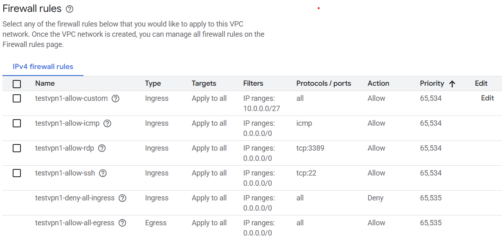

# firewalls in GCP

GCP allows to configure firewalls on different levels

## VPC Firewall
During VPC network creation we can create Firewall rules. By default all ingress (from Internet) is denied and all egress is allowed. 



The rules are applied on the network level and validated during each data exchange. I think about these as rules that will be applied for each VM that will be added to the network. 

- Can I ping VM1 from VM2 in the same VPC?
- Can I ping VM1 from VM2 in two different VPCs?

```
gcloud compute networks create vpc0 --subnet-mode=custom
gcloud compute networks subnets create subnet0 --range=10.0.0.0/27 --network=vpc0 --region=us-central1

gcloud compute instances create vm-1 --zone=us-central1-a --machine-type=e2-micro --subnet=subnet0
gcloud compute instances create vm-2 --zone=us-central1-a --machine-type=e2-micro --subnet=subnet0
```

- I can SSH through browser to VM1 and VM2
- I can ping VM2 from VM1
- I can access Internet ```curl -L google.com```
