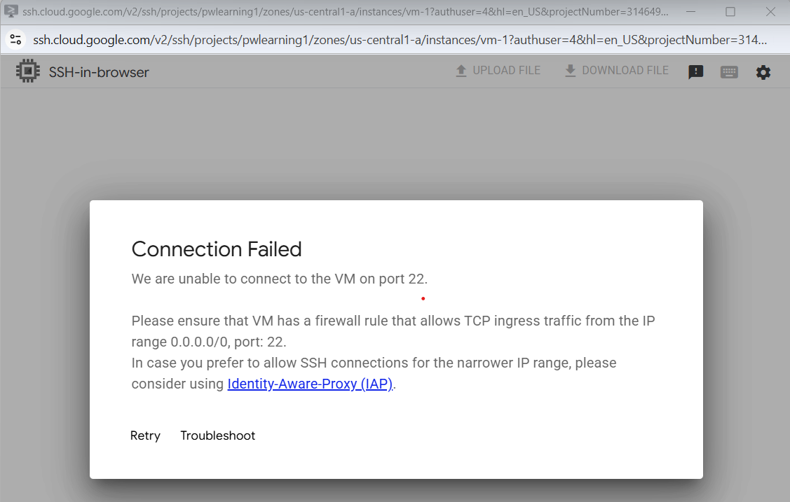
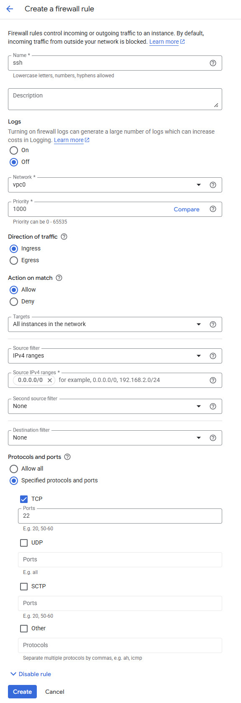
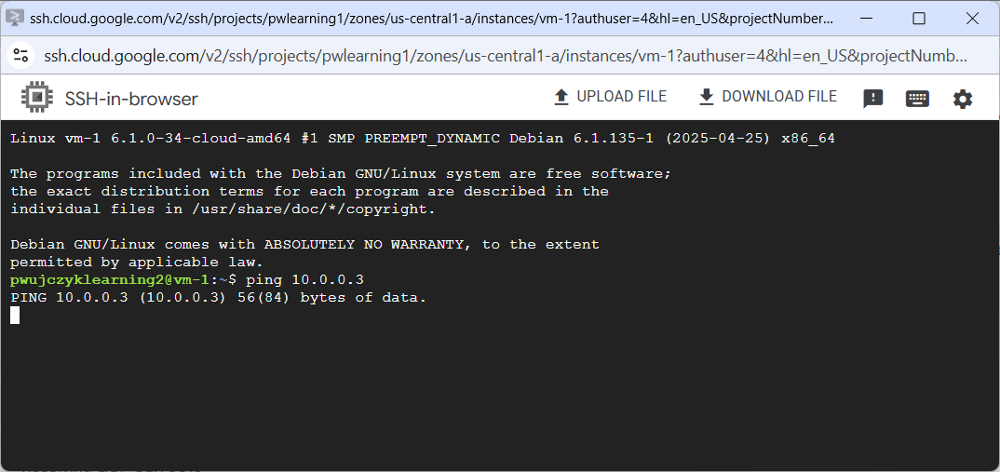
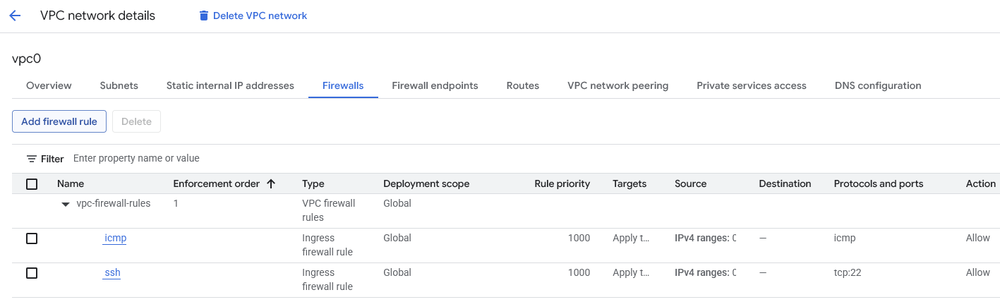
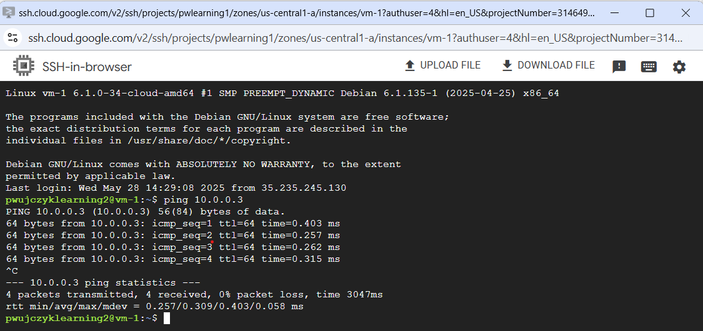

VM without any Firewall rules - SSH & Ping

This short tutorial shows that we need to create additional rule for the VPC firewall to access vm through SSH

Resources

```
gcloud compute networks create vpc0 --subnet-mode=custom
gcloud compute networks subnets create subnet0 --range=10.0.0.0/27 --network=vpc0 --region=us-central1

gcloud compute instances create vm-1 --zone=us-central1-a --machine-type=e2-micro --subnet=subnet0
gcloud compute instances create vm-2 --zone=us-central1-a --machine-type=e2-micro --subnet=subnet0
```
SSH to the VM ater creation VM and without any firewall rules is denied.



To enable connection we need to allow ssh connection:



```bash
gcloud compute firewall-rules create ssh --direction=INGRESS --priority=1000 --network=vpc0 --action=ALLOW --rules=tcp:22 --source-ranges=0.0.0.0/0
```
After adding it we can connect to SSH.

We cannot ping the VM2 from VM2



Adding icmp
```
gcloud compute firewall-rules create icmp --direction=INGRESS --priority=1000 --network=vpc0 --action=ALLOW --rules=icmp --source-ranges=0.0.0.0/0
```



After the change ping will work.



Remove
```
gcloud compute instances delete vm-1 --zone=us-central1-a -q
gcloud compute instances delete vm-2 --zone=us-central1-a -q

gcloud compute firewall-rules delete ssh -q
gcloud compute firewall-rules delete icmp -q
gcloud compute networks subnets delete subnet0 --region=us-central1 -q
gcloud compute networks delete vpc0 -q
```