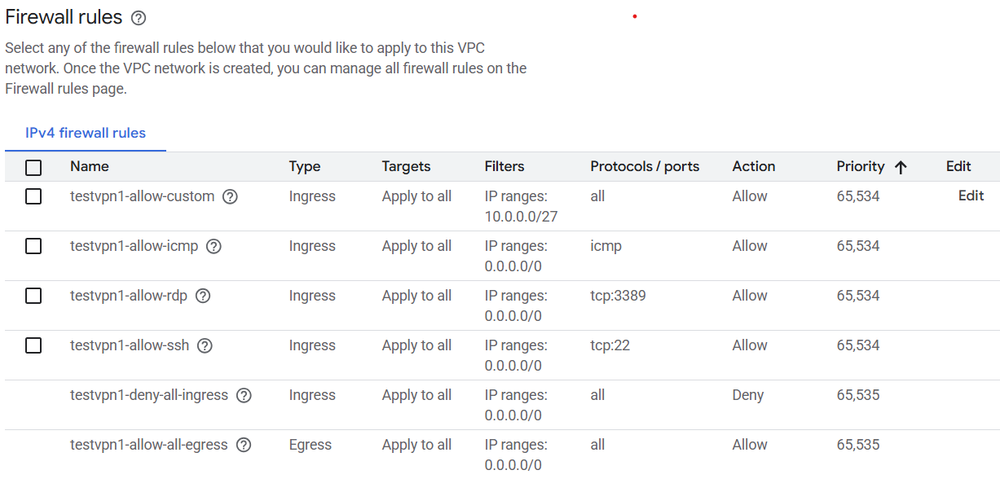

# firewalls in GCP

GCP allows to configure firewalls on different levels

## VPC Firewall
During VPC network creation we can create Firewall rules. By default all ingress (from Internet) is denied and all egress is allowed. 

The rules are applied on the network level and validated during each data exchange. I think about these as rules that will be applied for each VM that will be added to the network

- [We cannot ssh into instance without new rule on VPC Firewall](./Firewals-SSH-Ping/Index.md)
- [We cannot ping vm1 instance from vm2 instance without new rule on VPC Firewall](./Firewals-SSH-Ping/Index.md)




- I can SSH through browser to VM1 and VM2
- I can ping VM2 from VM1
- I can access Internet ```curl -L google.com```
