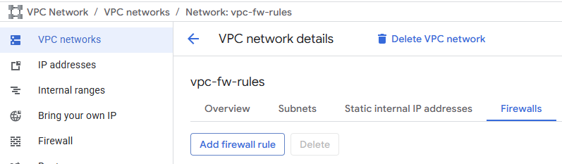
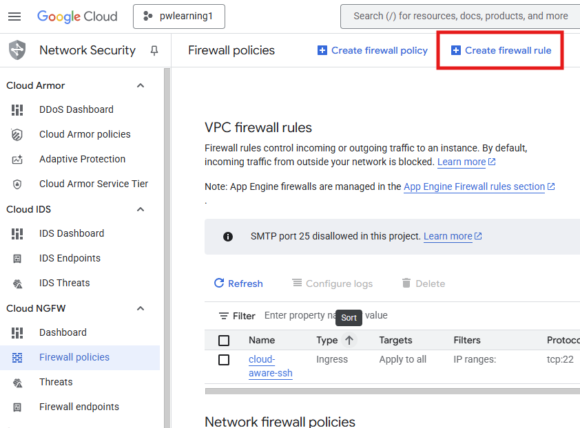
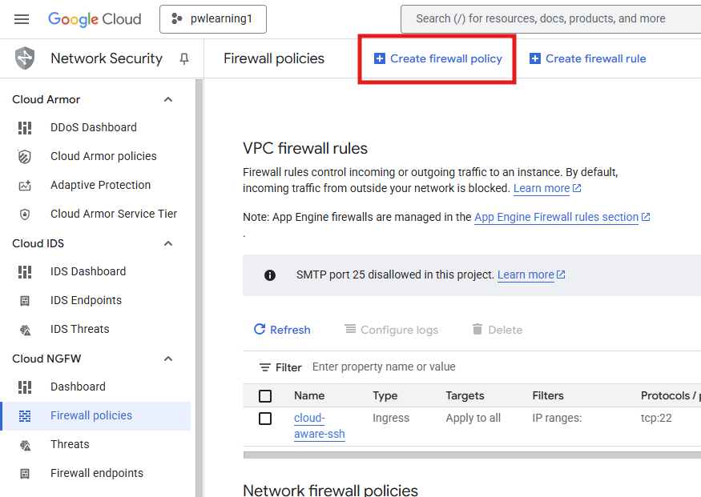
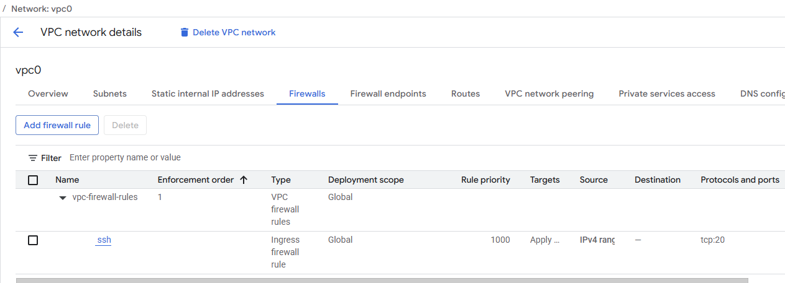

# firewalls in GCP

GCP allows to configure firewalls on different levels

## VPC Firewall
During VPC network creation we can create Firewall rules. By default all ingress (from Internet) is denied and all egress is allowed. 


The rules are applied on the network level and validated during each data exchange. I think about these as rules that are applied on each VM that is in the network like VM firewall. 

- [We cannot ssh into instance without new rule on VPC Firewall](./Firewals-SSH-Ping/Index.md)
- [We cannot ping vm1 instance from vm2 instance without new rule on VPC Firewall](./Firewals-SSH-Ping/Index.md)


GCP allow us to create firewall rules in places:

- VPC firewall **Create a firewall rule**

VPC Networks &#187; Chose VPC Network &#187; 
    Firewalls &#187; Add Firewall rule




VPC Networks &#187; Firewall  &#187; Create filewall 
rule



- NGFW (Next Generation Firewall)

VPC Networks &#187; Firewall  &#187; Create filewall 
policy




### VPC firewall and NGFW rules order

How Service behaves when we set different rules in the two firewalls?

Let us create 
- VPC with one subnetwork and opened port for ssh



- VM with the apache installed

```shell
sudo apt-get update 
sudo apt-get install apache2 -y
echo '<!doctype html><html><body><h1>Hello World!</h1></body></html>' | sudo tee /var/www/html/index.html
```

