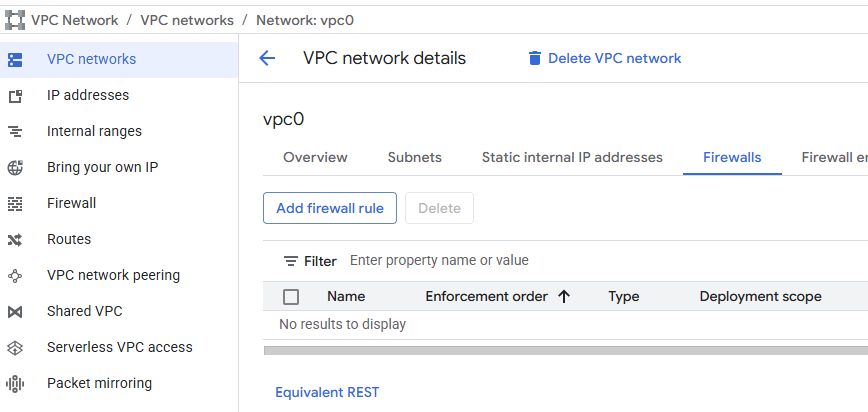
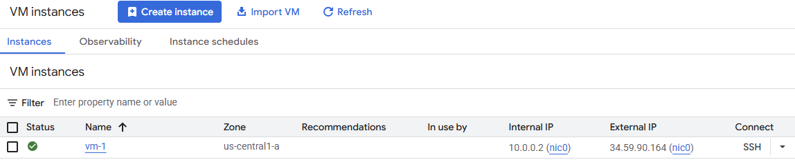
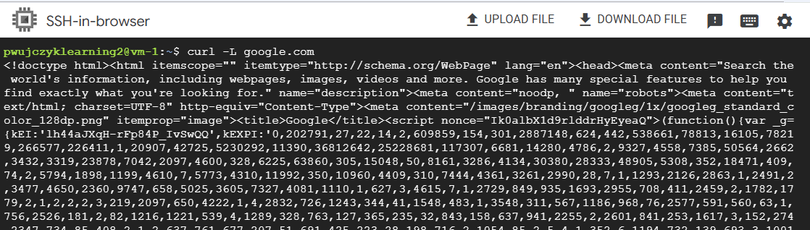
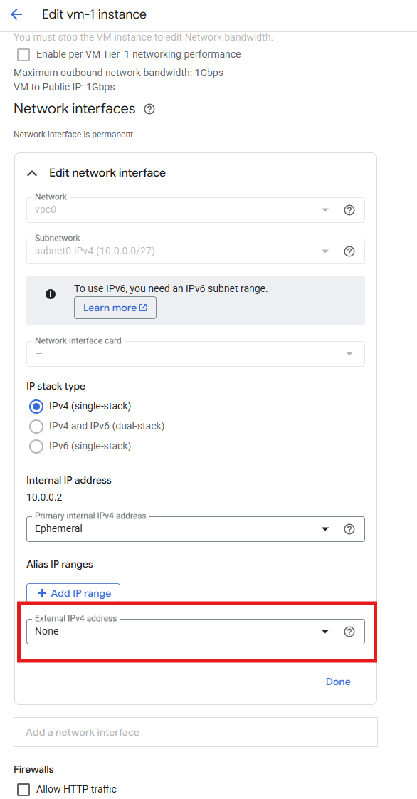
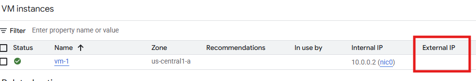
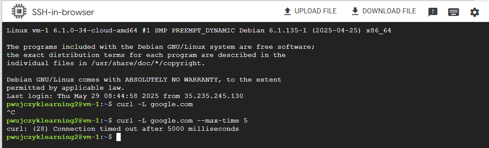
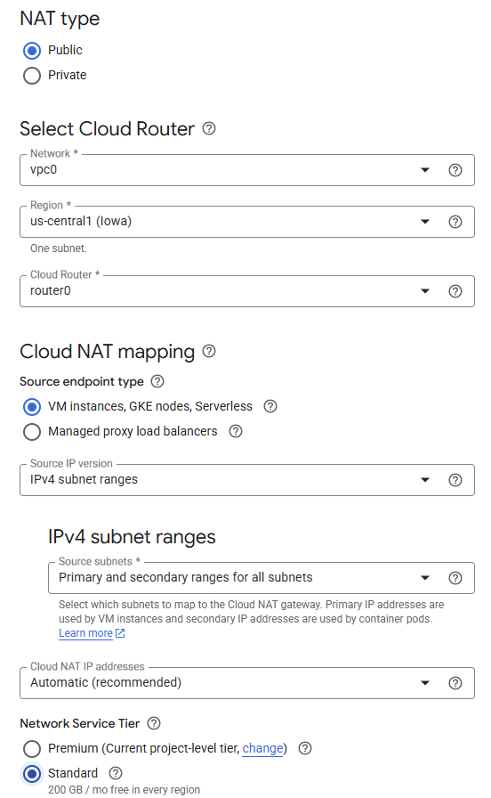
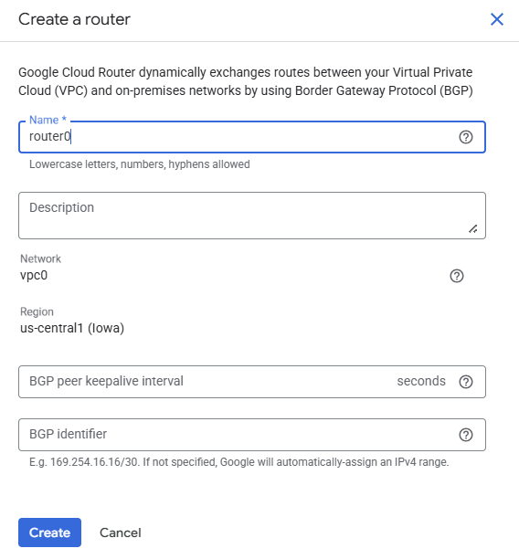
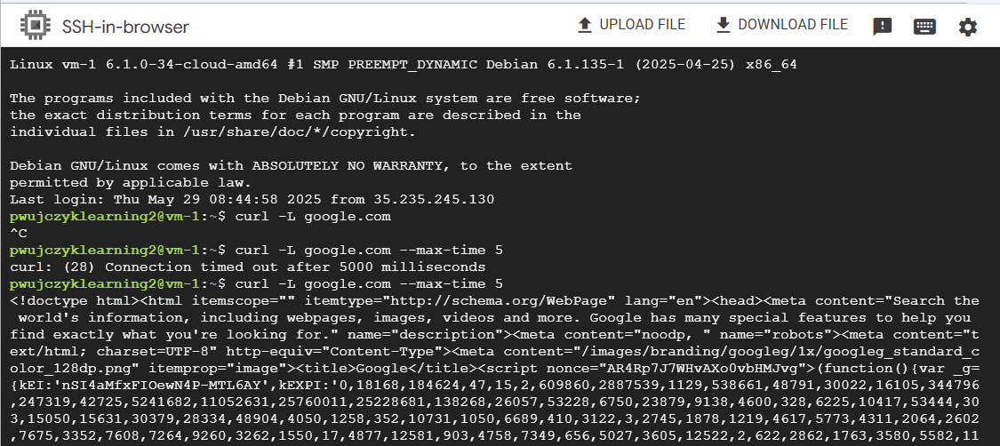

# Cloud NAT

Cloud NAT allows to communicate VMs without public IP connect to the Internet. 
It is similar to home network. At home we have NAT as only our internet provider give us only one external IP and it is assigned to the router. This is also security mechanism (that most users do not care)

In the cloud Cloud NAT is mainly the security mechanism. VMs do not have public IPs and they can connect to the Internet only through NAT.

The tutorial below will:
- Create VPC 
- Create Subnetwork
- Create VM and validate internet access
- Remove the public IP
- **Show that VM without public address cannot acces Internet**
- Create Cloud Nat 
- **Show that VM without public address but in the subnetwork that has NAT assigned can access Internet**


Create VPC and subnetwork

```
gcloud compute networks create vpc0 --subnet-mode=custom
gcloud compute networks subnets create subnet0 --range=10.0.0.0/27 --network=vpc0 --region=us-central1
```
By default VPC has firewall enabled that does not allow for any incomming traffic to VMs. Add a firewall rule
- VPC Networks
- vpc0 (created network)
- Firewalls
- Add firewall rule



### Rule
- Source IPv4 ranges: 0.0.0.0/**0**
- Specified protocols and ports
    - TCP: 22

Create VM (with external IP enabled)
```
gcloud compute instances create vm-1 --zone=us-central1-a --machine-type=e2-micro --subnet=subnet0 
```


Connect through web ssh and check the internet access ```curl -L google.com```

VM has the connection, because:
- VM **has** the firewall rule that allows for egress
- VM **has** external address 
- Subnetwork sub0 does not have Internet connection  



Edit the vm and turn off the external IP.





Check the internet access again.

VM does not have the connection, because:
- VM **has** the firewall rule that allows for egress
- VM **does not** have external address 
- Subnetwork sub0 **does not** have Internet connection  



Go to Cloud NAT

Create new Cloud NAT, majority of the fields are easy to fill rest, leave with default values

Notice that you are creating NAT service for the whole VPC (not for the subnet)



In the field **Cloud Router** create new one



Go again to the ssh window and validate that internet access works right now



VM does not have the connection, because:
- VM **has** the firewall rule that allows for egress
- VM **does not** have external address 
- Subnetwork sub0 **has** Internet connection throug NAT
