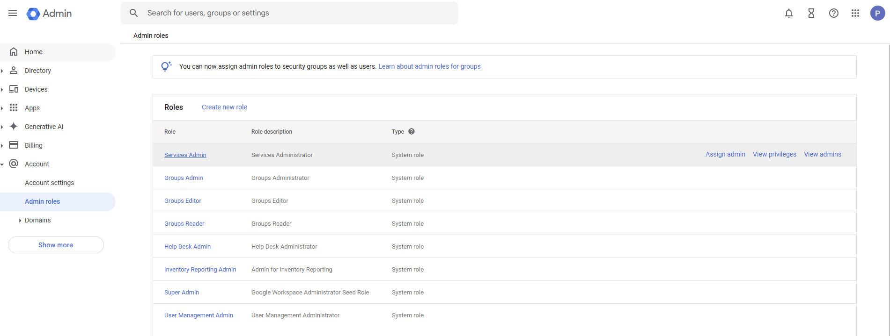
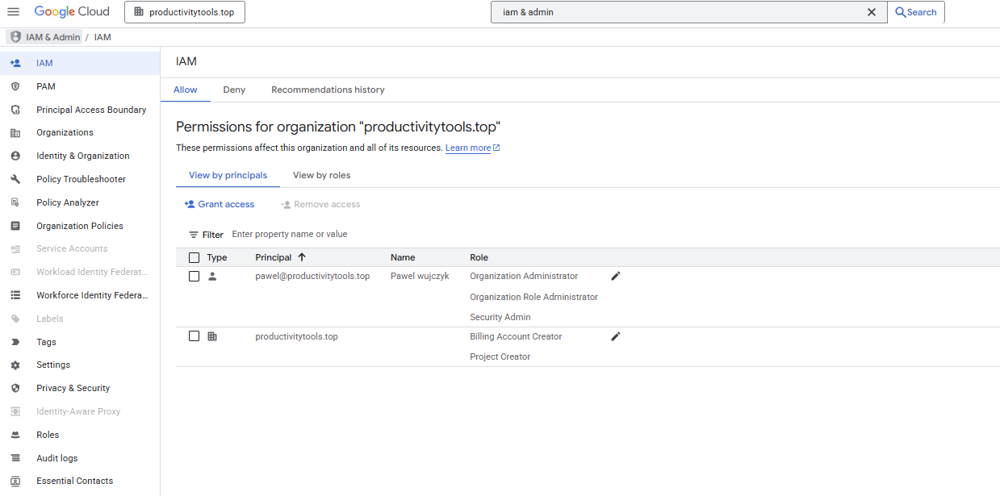

# Drop 
Only drop of steps not ordered:

- [Chose Cloud identity](https://cloud.google.com/resource-manager/docs/creating-managing-organization)
- Domain is required
- During the process remember your username (they will ask you to create one)
- After craeting account sign in to the [admin platform](http://admin.google.com/) Tricky think is that sign in with the user in your domain (crated in the previous tutorial)
- Later Billing get more services cloud itentity

```
You do not have the required "resourcemanager.projects.create" permission to create projects in this location.s
```

- The organization did not show up but after 30 minutes of doing I am not sure what it showed. 




