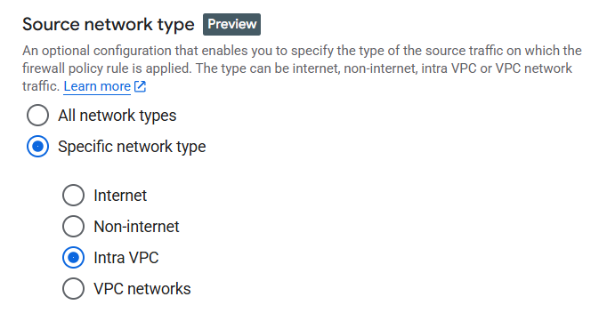

# Firewal policy details

List of the Filewall rules with the options to create new one

## Create **Firewall rule**

### Source network type
Allows to apply rule only to chosen scope. (Internet, non-internet, Intra VPC - within VPC network, VPC networks)

