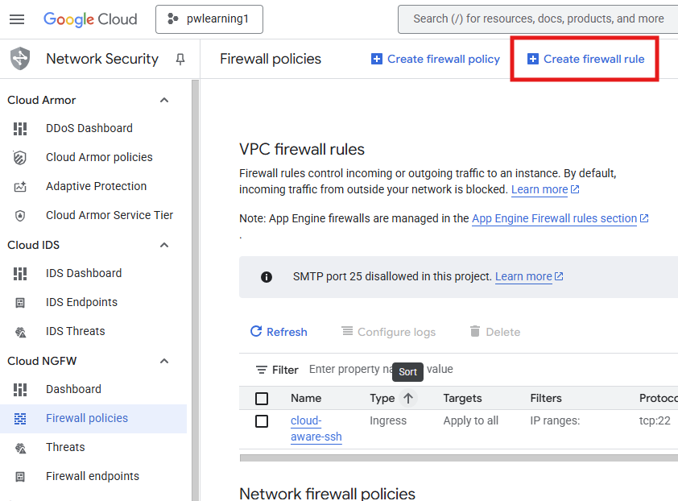
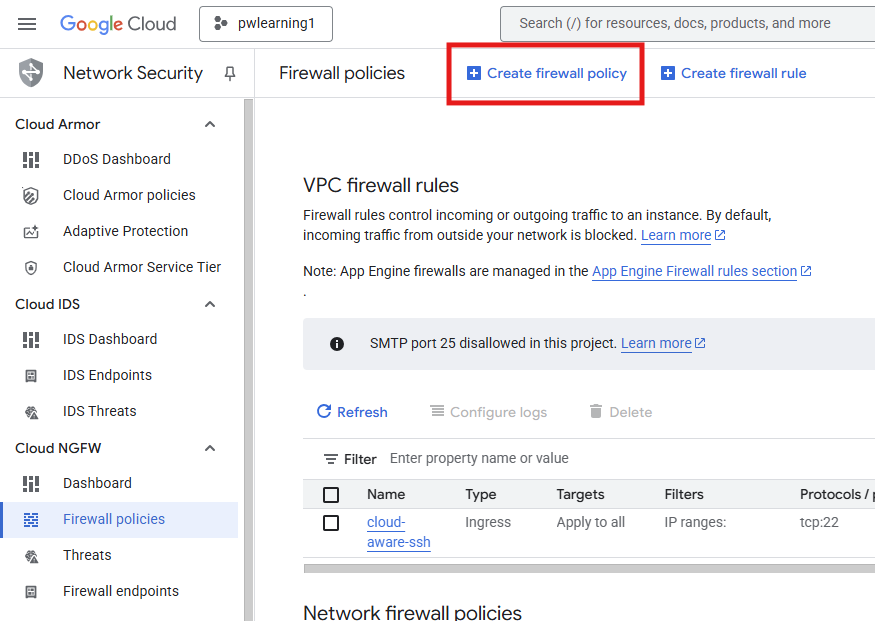
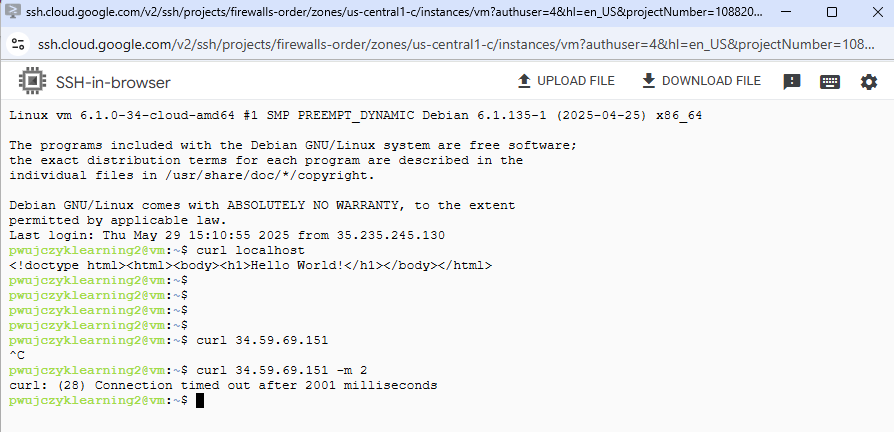
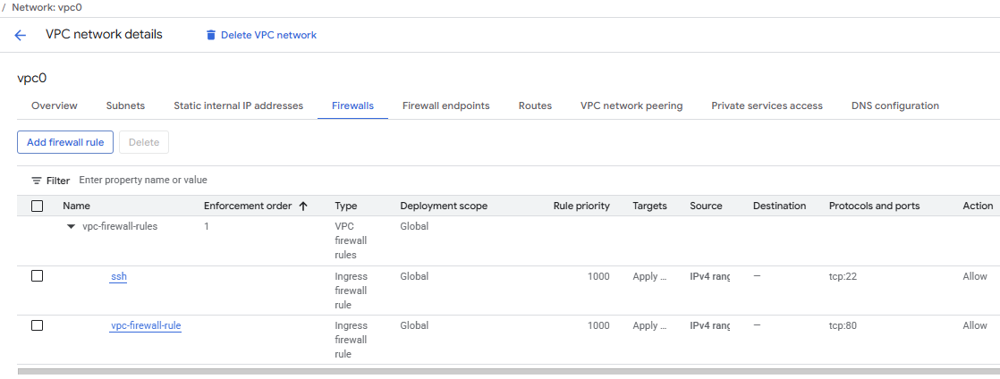
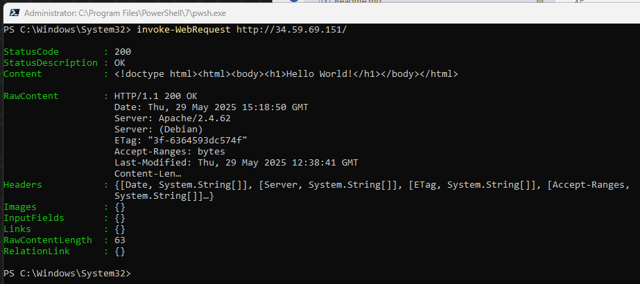

# Firewalls rules in GCP

GCP allows to create firewall rules in three places 
 - VPC Policy 
 - NGFW Policy
 - Organization Project policy (described in the paragraph below as this is special case)

 Each request is evaluated in sequence
 VPC Firewall rules &#187; NGFW Policies

 If rule matches in the VPC Firewall rule the NGFW rule won't be validated.

|VPC Policy|NGFW Policy|Result|
|---------|-----------|------|
|No rule|no rule|page does not work
|Deny 80|Allow 80| page does not work
|Allow 80| no rule|page works
|Allow 80|Allow 80| page works
|Allow 80|Deny 80| page works
|No rule| Allow 80|page works

GCP allow us to create firewall rules in places:

- VPC firewall **Create a firewall rule**

VPC Networks &#187; Chose VPC Network &#187; 
    Firewalls &#187; Add Firewall rule


VPC Networks &#187; Firewall  &#187; Create filewall 
rule



- NGFW (Next Generation Firewall)

VPC Networks &#187; Firewall  &#187; Create filewall 
policy



### VPC firewall and NGFW rules order

How Service behaves when we set different rules in the two firewalls?

Let us create 
- VPC with one subnetwork and opened port for ssh


- VM with the apache installed

```shell
sudo apt-get update 
sudo apt-get install apache2 -y
echo '<!doctype html><html><body><h1>Hello World!</h1></body></html>' | sudo tee /var/www/html/index.html
```
Let us validate that server, but request to external IP fails



### VPC firewall rule

VPC Network &#187; *VPC0* &#187; Firewalls &#187; Add firewall rule

```
Action on match: alow
All instances in the network
Source IPv4 ranges: 0.0.0.0/0
TCP 80
```


It works



Remove the rule

### NGFW rule

VPC Network &#187; *VPC0* &#187; Firewall &#187; Create firewall policy

```
Ingress
Target: Apply to all
Source filters 0.0.0.0/0
Destination  0.0.0.0/0
Protocols and ports > Specified protocols and ports > TCP > 80
Associate policy with VPC networks (optional) > vpc0
```

VPC Rule deny
```
Action on match: deny
All instances in the network
Source IPv4 ranges: 0.0.0.0/0
TCP 80
```

## Organization or folder policy

Firweall rules can be also created on the organization or folder level.

Rules can be evaluated before or after the VPC rules.

This command validates the mode.
```
gcloud compute networks describe vpc0 --format="value(networkFirewallPolicyEnforcementOrder)"
```

- AFTER_CLASSIC_FIREWALL

VPC Firewall rules &#187; Policy rules &#187; NGFW Policies

- BEFORE_CLASSIC_FIREWALL

NGFW Policies &#187; VPC Firewall rules &#187;  Policy rules


```
gcloud compute networks update vpc0  --network-firewall-policy-enforcement-order BEFORE_CLASSIC_FIREWALL 
```

