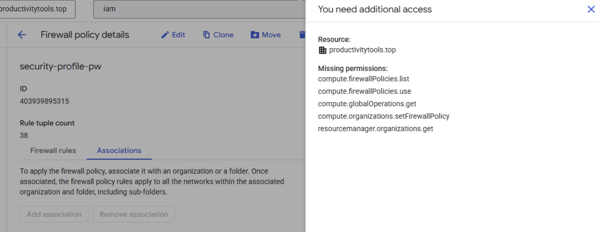
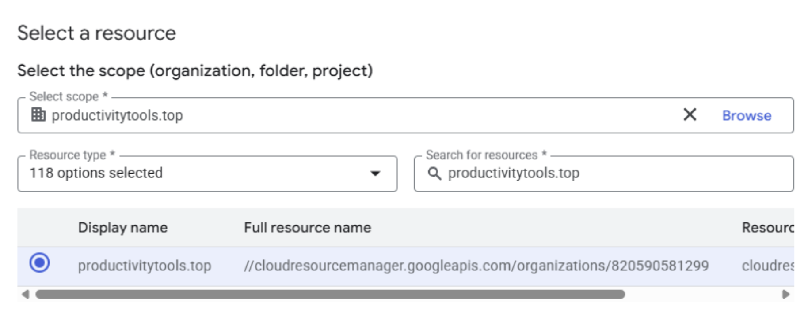
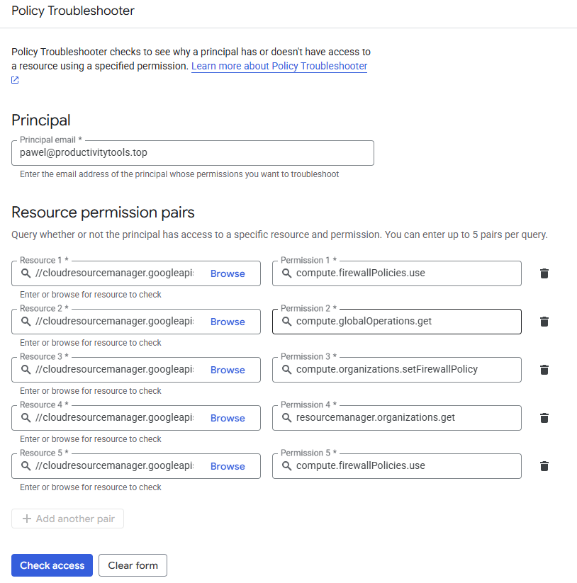
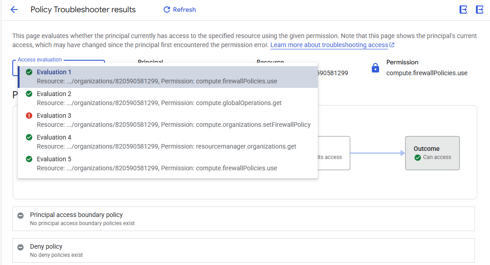
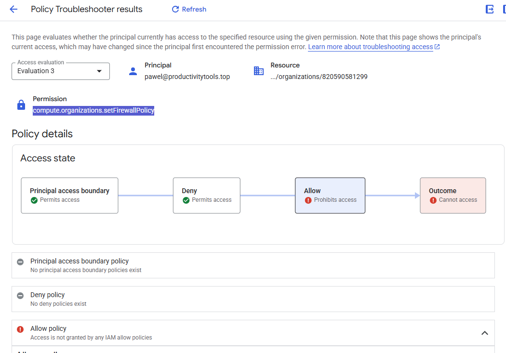
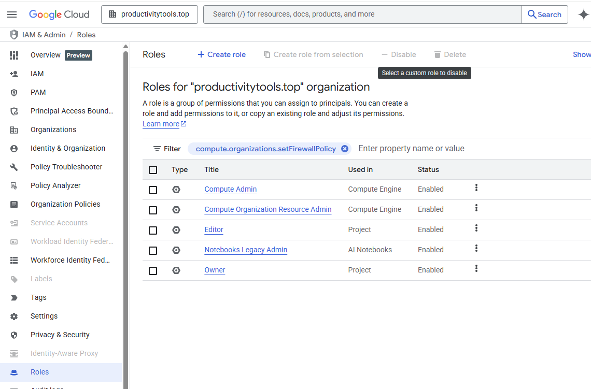

# Policy Troubleshooter

Path: **IAM & Admin/Policy troubleshooter**

GCP permissions have two levels 
- Permissions - this is the atomic permission that you need to have to perform an action it looks like *compute.firewall.list*. It describes what actually you can do with it.
- Roles - are the group of profiles for example **Compute Admin** role groups all the permissions that Cloud thinks Compute admin should have.

The trick is that when you try to do something permissions are validated and permissions are shown in errors, but you assign roles to the users. 

It is not straightforward what roles you should assign to yourself when you face error.

**Policy troubleshooter** is a tool that should help to find the proper role. 

## Example

I see that I have one button disabled and when I hover it I see that I miss permissions

Clicking View details I see that the resource that I need permission is the productivitytools.top organization

Let us go to the policy troubleshooter IAM and Admin > Policy Troubleshooter

I provided the email that I am logged in and the permission that was listed in the tooltip.

For the resource I chose Browse and look for the resource that was listed in the side panel - productivitytools.top

We can add multiple permissions

In the next screen in the drop down we have results for all evaluations

Check the details for the permission

## Find the correct role based on the permission
Go to IAM Roles and search for permission it will return the roles where permission is used.

