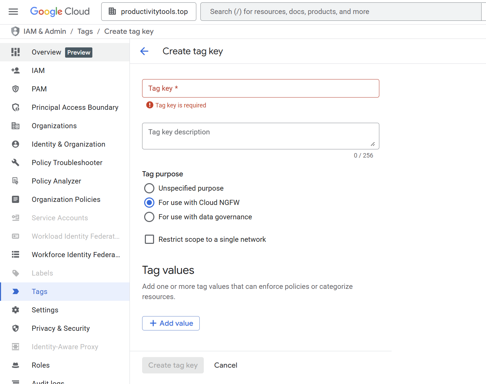
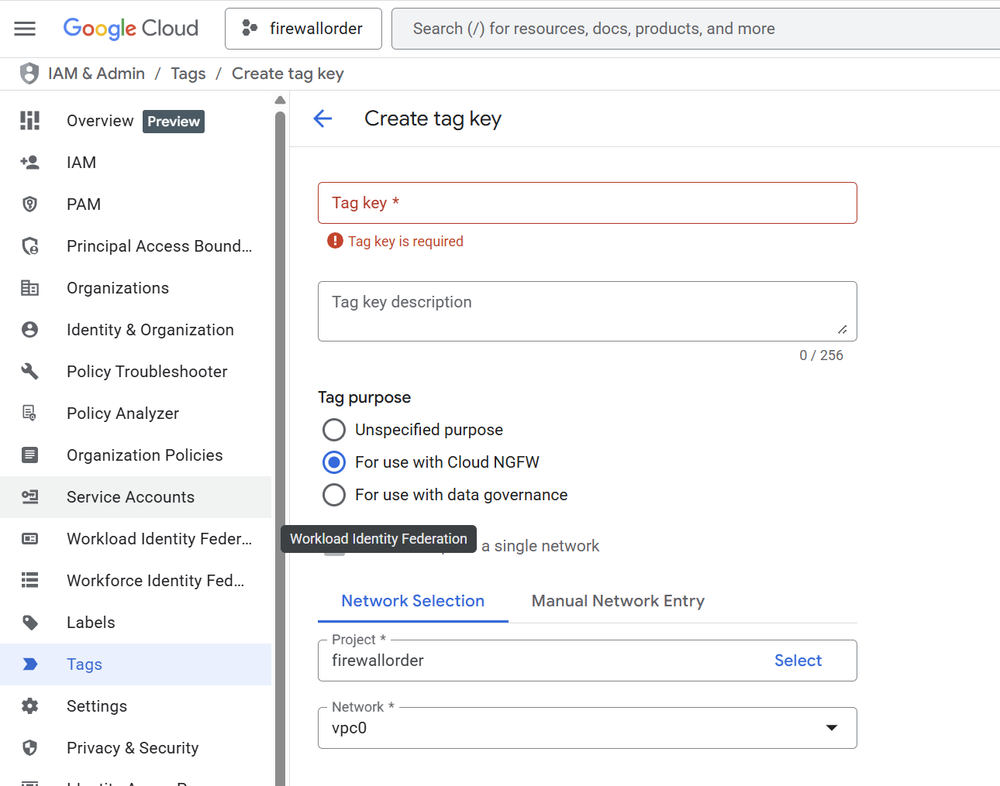
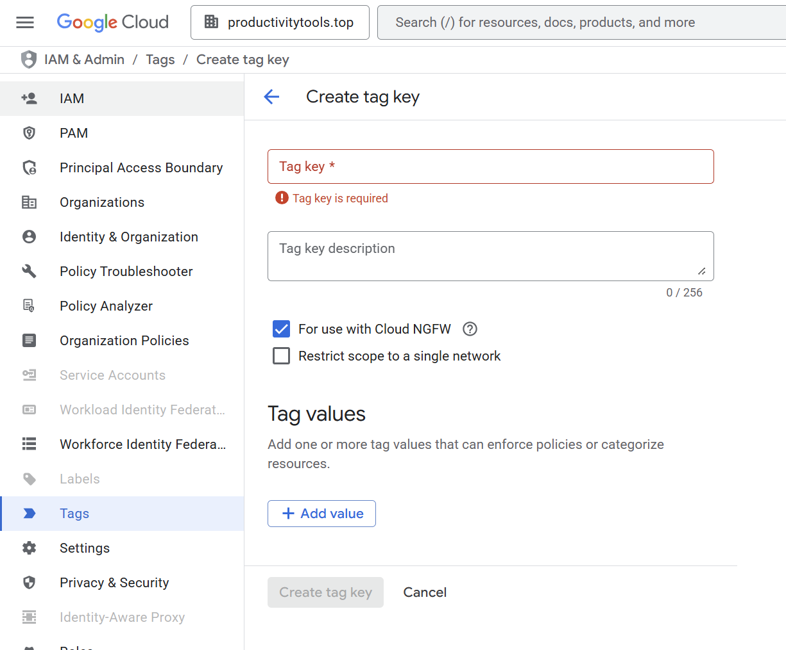
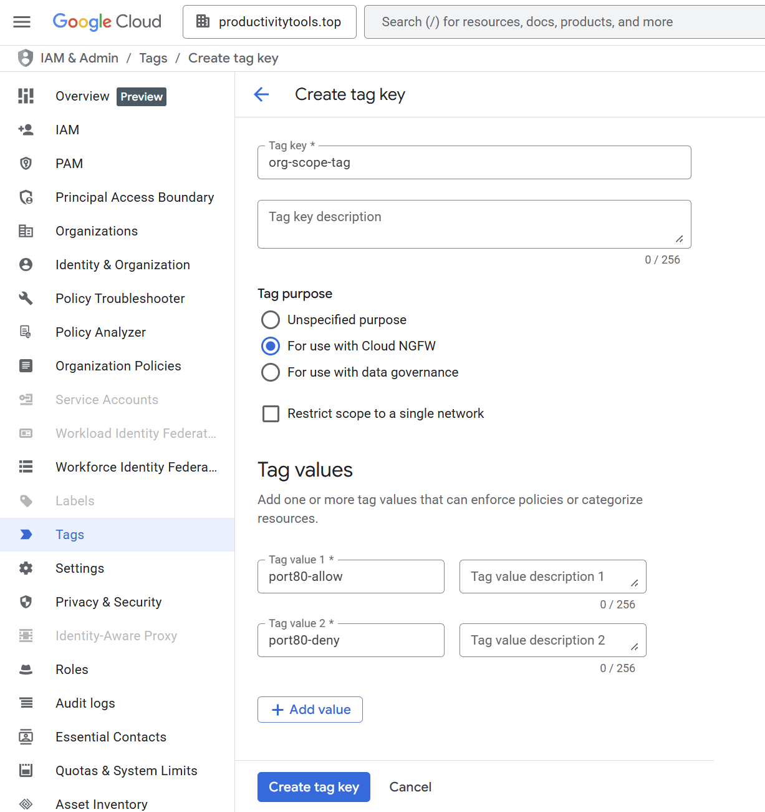
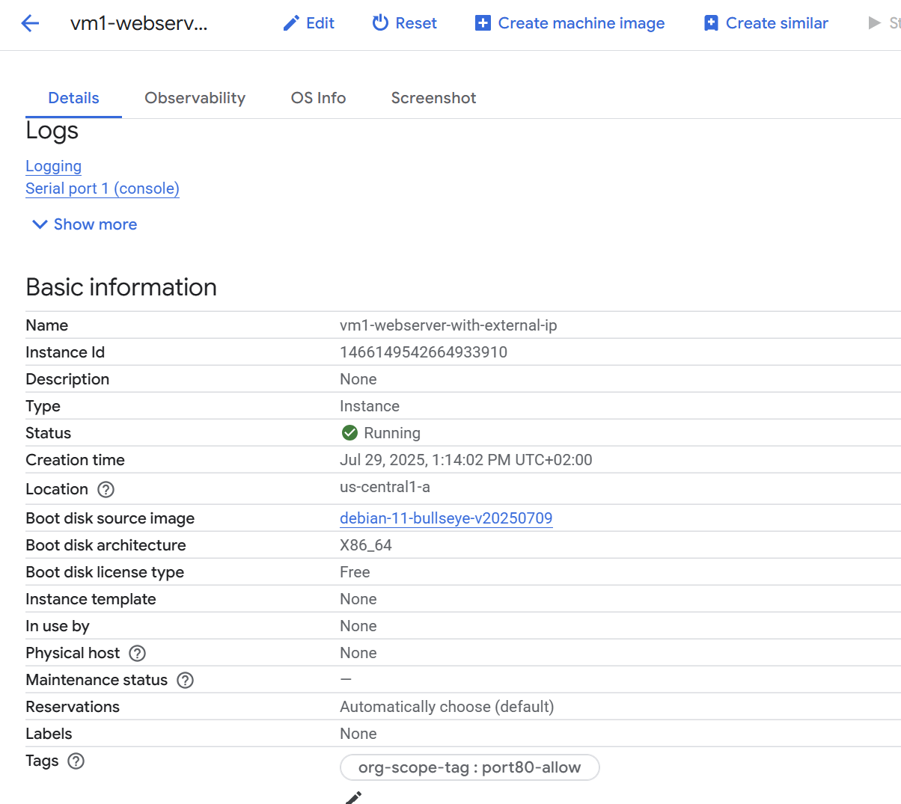
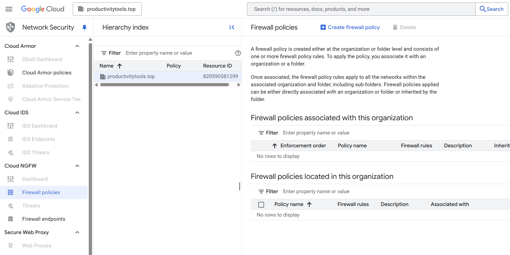
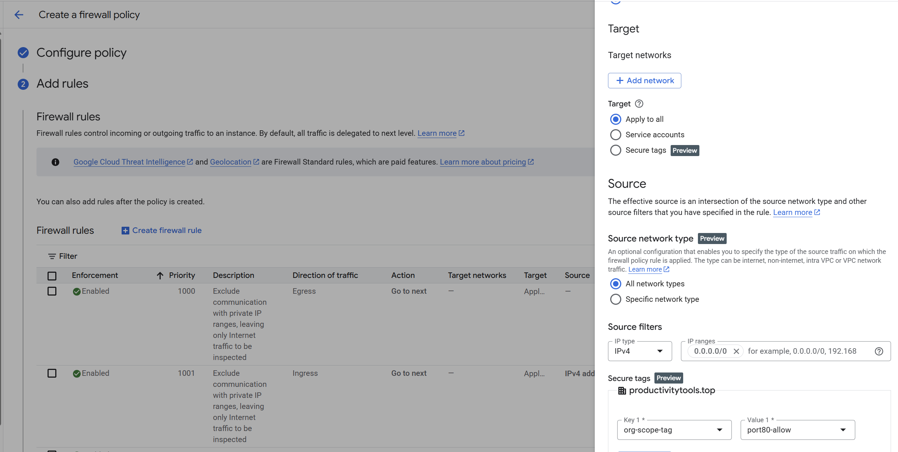
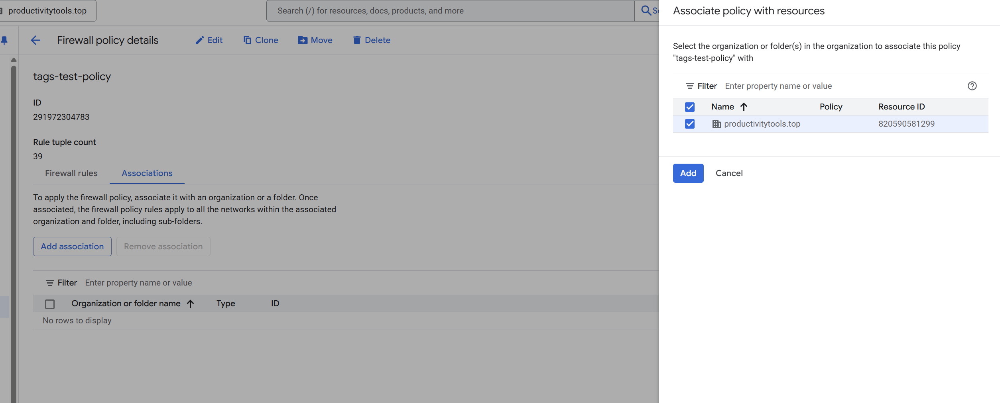

# Tags

The functionality can be enabled on the project and organization level. 

When tag is created on the organization level then it can be used in all child projects.

2025 Version


When project is chosen, tag needs to be assigned to VPC.





## Example

The following example shows how to create **org-scope-tag** that has two values
- port80-allow
- port80-deny

Tag is created on the organization level.



Tag detail


```
# variables
export PROJECT="pwujczyklearning"
export PROJECT="firewallorder"
export REGION="us-central1"
export ZONE="us-central1-a"

export VM0_NAME='vm1-empty'
export VM1_NAME='vm1-webserver-with-external-ip'
export VM2_NAME='vm2-client'

export NETWORK_NAME="$USER-2vm-test"
export SUB_NETWORK_NAME="$USER-2vm-test-subnetwork"
```


```
# Create network
gcloud compute networks create $NETWORK_NAME \
    --subnet-mode=custom \
    --mtu=1460 \
    --project=$PROJECT
```
```
# Create subnetwork
gcloud compute networks subnets create $SUB_NETWORK_NAME \
    --region=$REGION \
    --network=$NETWORK_NAME \
    --range=10.0.0.0/27 \
    --enable-private-ip-google-access \
    --project=$PROJECT
```

# Create SSH to be able to connect to VM
```
gcloud compute firewall-rules create ssh-allow \
--direction=INGRESS \
--priority=1000 \
--network=$NETWORK_NAME \
--action=ALLOW \
--rules=tcp:22 \
--project=$PROJECT 
```

# Create VM1 - web-server
```
gcloud compute instances create $VM1_NAME \
    --image-project=debian-cloud \
    --image-family=debian-11 \
    --machine-type=e2-micro \
    --zone=$ZONE \
    --network-interface="network-tier=PREMIUM,stack-type=IPV4_ONLY,subnet=$SUB_NETWORK_NAME" \
    --project=$PROJECT \
    --metadata=startup-script='#! /bin/bash
        sudo apt-get update
        sudo apt-get install -y apache2
        sudo systemctl start apache2
        sudo systemctl enable apache2
        echo "<h1>Welcome to your new Apache server on GCP!</h1><h3>Machine: '$VM_NAME'</h3>" | sudo tee /var/www/html/index.html'


```


## Removing resources


```
# Delete VM1 - Client
gcloud compute instances delete $VM1_NAME \
    --zone=$ZONE \
    --project=$PROJECT \
    --quiet
```

```
# Delete subnet
gcloud compute networks subnets delete $SUB_NETWORK_NAME \
    --region=$REGION \
    --project=$PROJECT \
    --quiet
```
```
# Delete network
gcloud compute networks delete $NETWORK_NAME \
    --project=$PROJECT \
    --quiet
```

For validation login to vm and do the ```curl localhost`` it should return the value


Try to open public ip in browser - it should not load.


Add tag to the VM


Validate if tag is assigned to vm



Page through public ip still should not load as we do not have firewall rule for this given tag.

Open firewall policies on the organization level and Create firewall policy



Create a rule that targets new tag



Associate firewall policy with the organizatoin



When you open external IP the page should load.