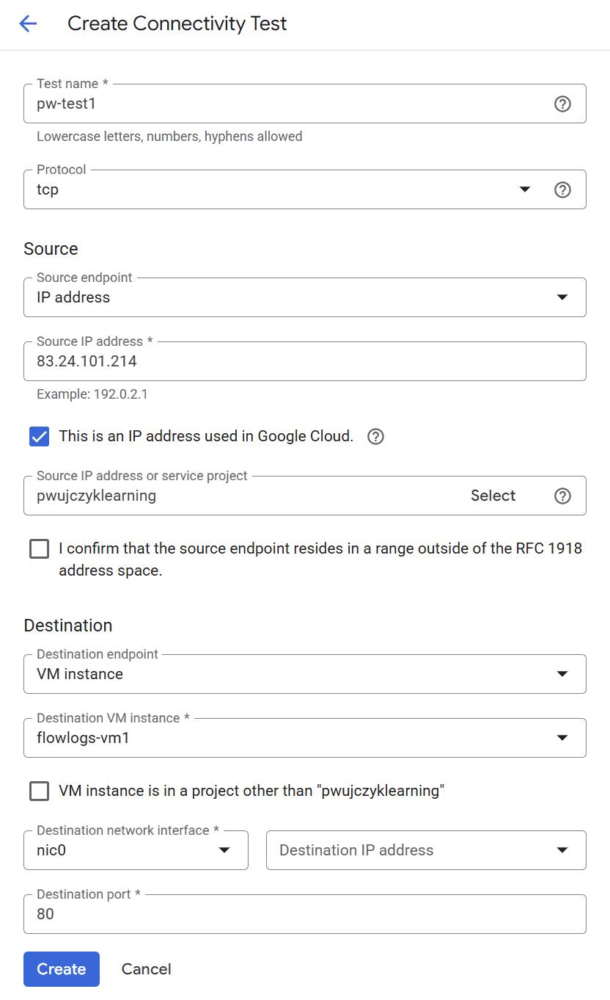
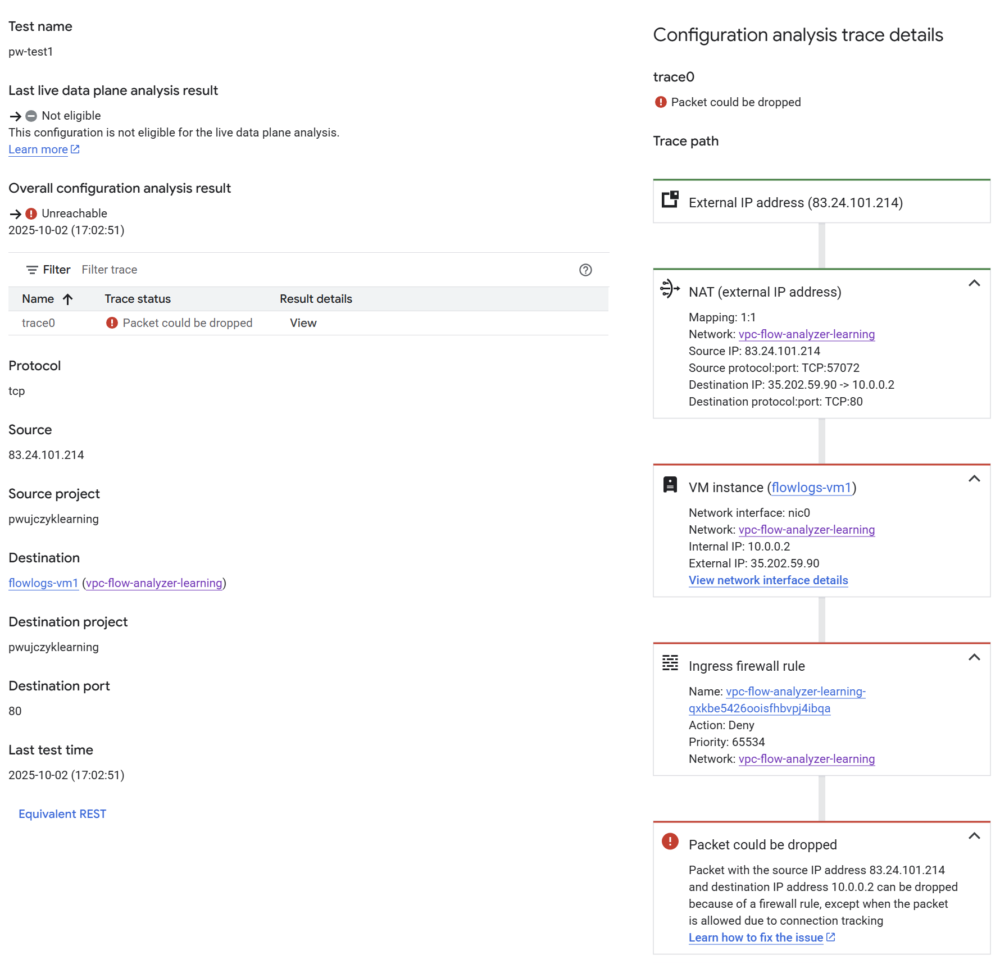
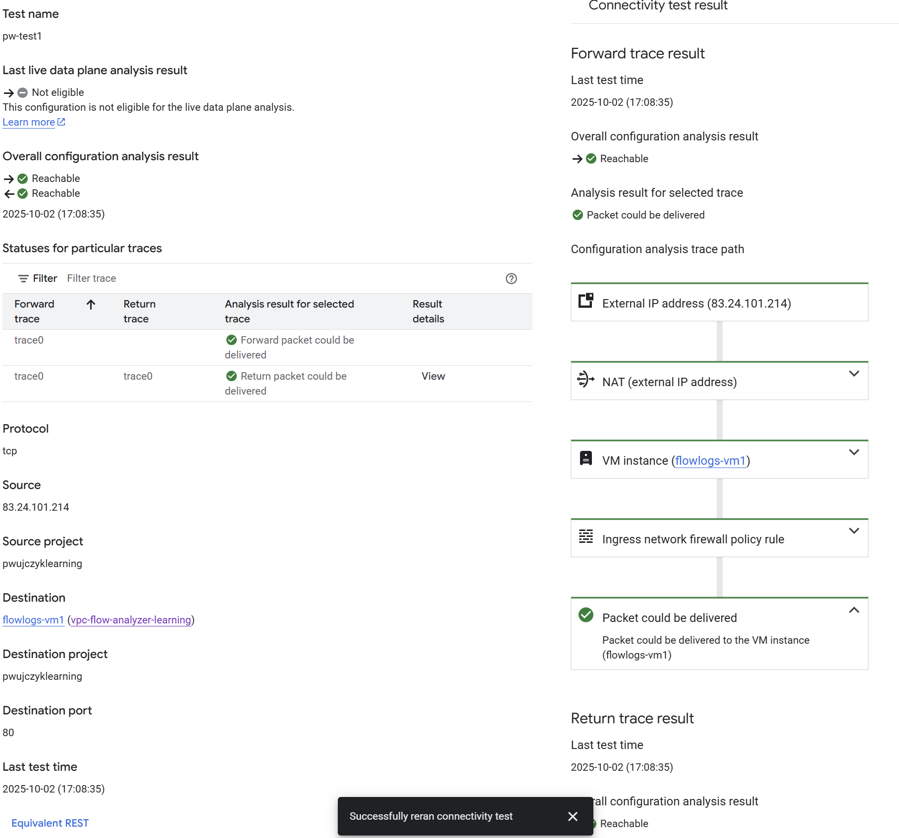

# Connectivity tests

Tests perform static analysis of the configuration and inform about potential problems regarding communication between two resources.

## Example
- Source IP: 83.24.101.214 - the IP of the computer with external IP in the Internet
- Destintation - flowlogs-vm1 - VM in the GCP

Result of the test show that Ingress firewall rule blocks the traffic

After removing the firewall rule the test succeeds

