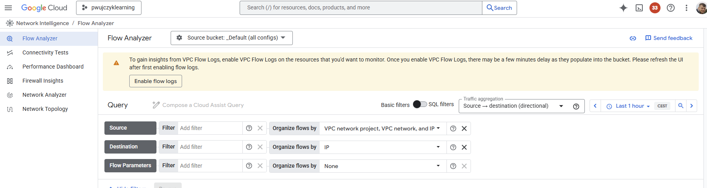
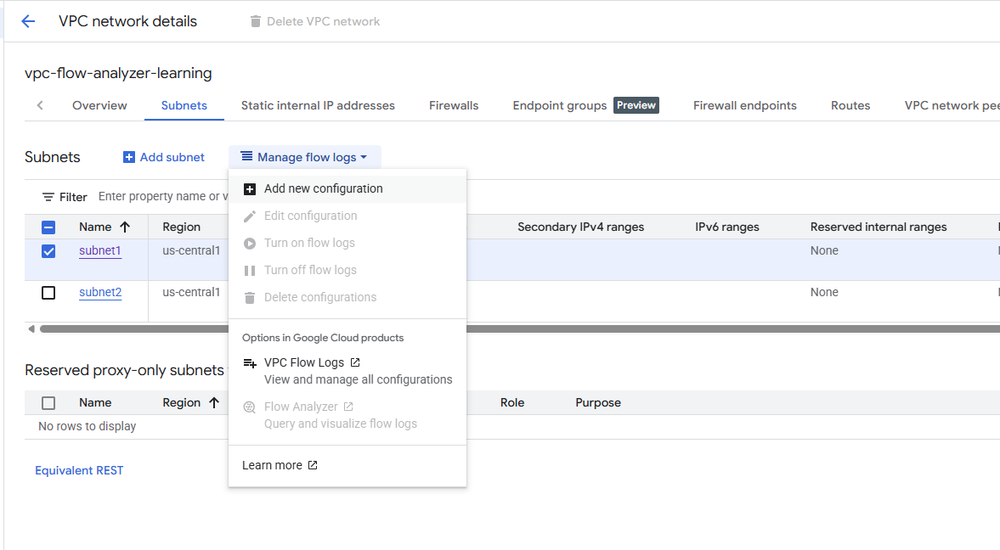

# Enable functionality

Flow Analyzer lets you perform opinionated network traffic analysis with 5-tuple granularity (source IP, destination IP, source port, destination port, and protocol).

Functionality is free, but customers need to pay for the storage that is used by logs 

## Enabling flow logs

