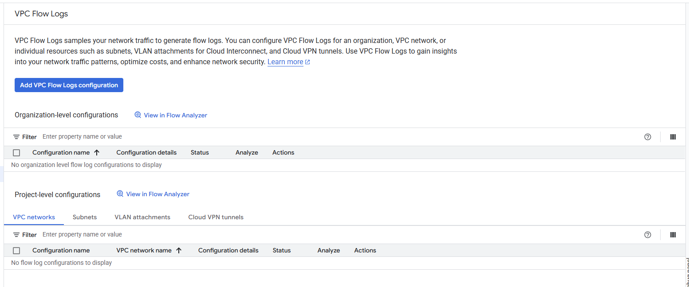
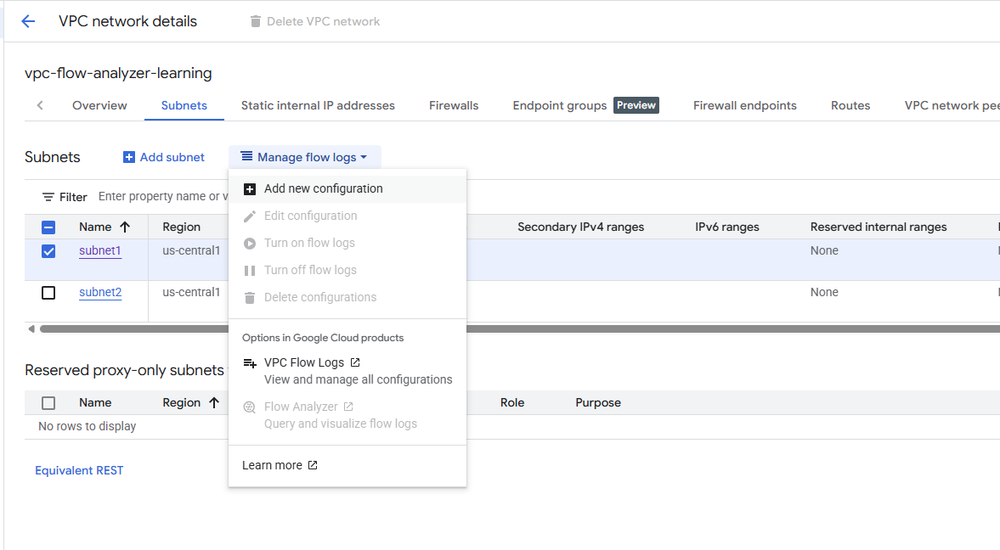

# Flow Analyzer

Flow Analyzer lets you perform opinionated network traffic analysis with 5-tuple granularity (source IP, destination IP, source port, destination port, and protocol).

Enabling flow logs

