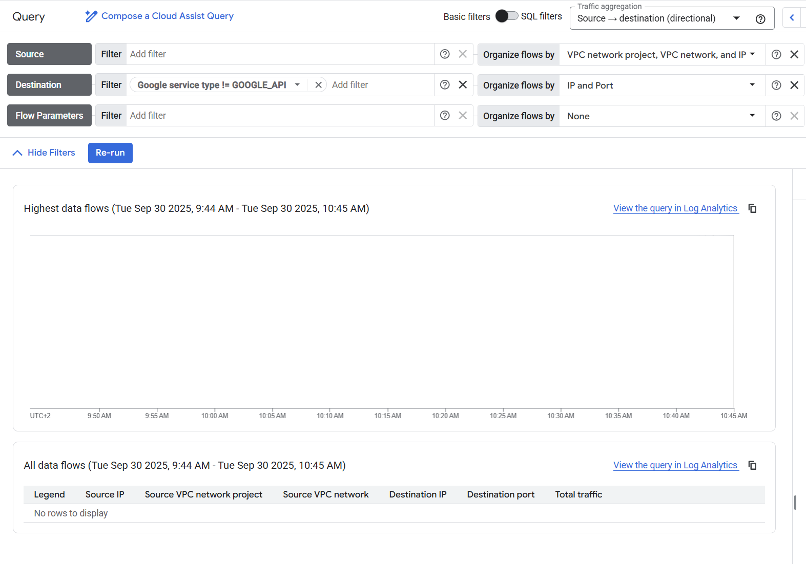

# Flow Analyzer

Flow analyzer displays information about bytes that travel through the network. It allows to chose google resource and analyze how much data is send and received by given resource. 

To use it **Flow logs** needs to be enabled for the network.

## Example

The example uses
- 2 VMs
- On each VM Apache is installed
- Pages from both VMs are exposed to the Internet

### No traffic

If VM does not have any traffic, the majority of the traffic is Google internal traffic. 
The Google internal traffic is the communication usually initated by the VM for example to send the logs to Flow logs. 

### Google Logging traffic

When we check the details of the traffic we see that the destination is the [logging.googleapis.com](https://cloud.google.com/logging/docs/reference/v2/rest)

If we filter google api the flow logs should be empty

