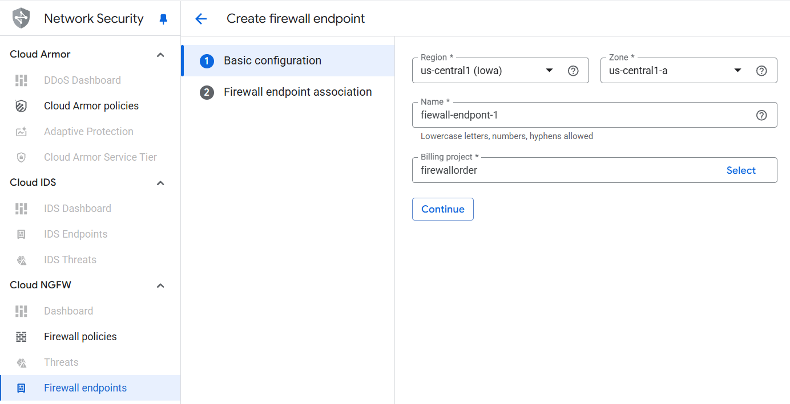
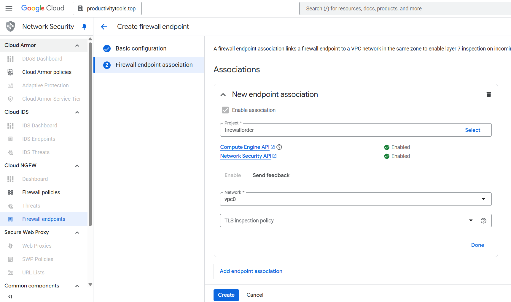
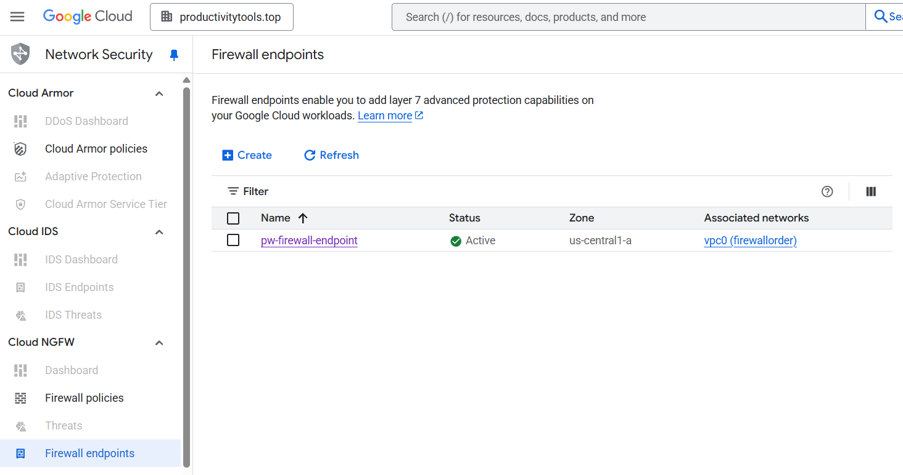
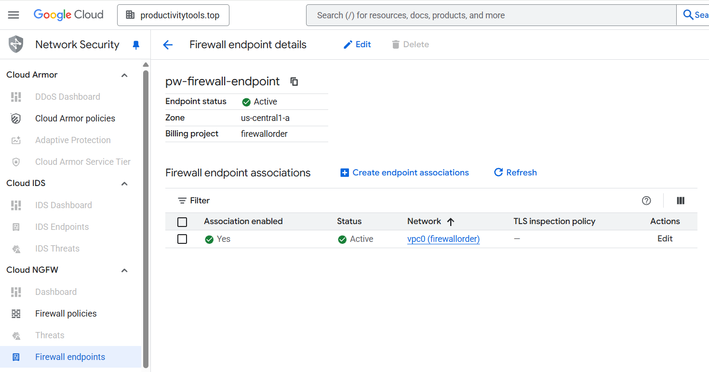

# Firewall endpoints

From google [docs](https://cloud.google.com/firewall/docs/about-firewall-endpoints):
- Firewall endpoints is a resource to configure Layer 7 firewall inspection on the intercepted traffic.

Firewall endpoint is one of the component of the **Intrusion detection and prevention** service. It redirects traffic to the Palo Alto software that performs packet analysis (malware, spyware, and command-and-control attacks). 

When Endpoint is created the Google Internal project with the Palo Alto service on the VMs is created. That is why Endpoint is a zonal resource. 

To redirect the traffic from given network to Threat prevension service, user needs to create Firewall Endpoint Association. Unfortunatelly as this is zonal resource, if customer covers all zones in the region with the Threat prevention, they need to confugre **Firewall endpoint association** multiple times.

When **Threat prevention is configured** user can validate the functionality by:
- monitoring dropped connections (when risky packet will be detect)
- monitoring the firewall_threat logs in the Logs Explorer

## Screens

### Create Firewall Endpoint screen

### Create Firewall Association screen

### Firewall endpoints list

### Firewall endpoint details

### Firewall_threat log explorer

