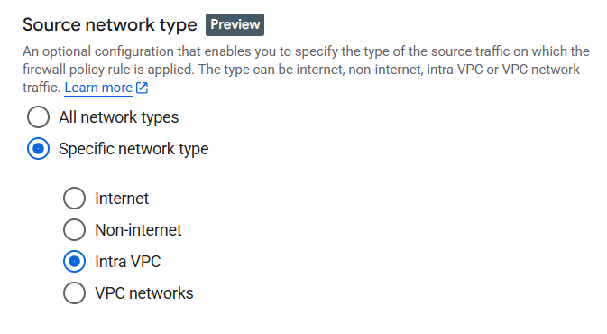

# Create firewall policy

## Deployment scope

Informs where the firewall policy is applied. It determines how widely the rules within the policy are enforced.

**Global** A global network firewall policy can be associated with one or more VPC networks across all regions. This means that the rules you define in a global policy apply to all subnets and instances within the associated VPC networks, regardless of their geographical location. This is useful for enforcing a consistent, centralized security posture across your entire organization

**Regional** A regional network firewall policy is specific to a particular Google Cloud region. The rules in a regional policy only affect the **subnets** and instances within the specified region. This is ideal for scenarios where you have specific, localized security requirements that only apply to resources in a certain region and don't need to be enforced globally.

## Firewall Rules

### Create firewall rule

#### Source network type
Allows to apply rule only to chosen scope. (Internet, non-internet, Intra VPC - within VPC network, VPC networks)

