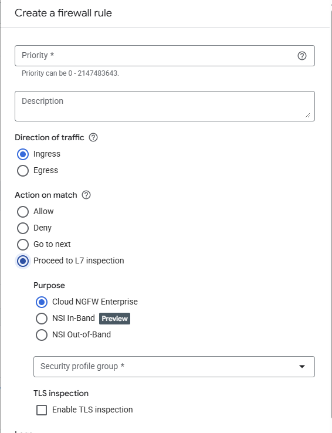

# Enable TLS inspection

## Proceeed to L7 inspection

NGFW has option **Proceed to L7 inspection** let us summarize what it does?

**Proceed to L7 inspection** requires providing the **Security profile group**. **Security profile group** has currently 3 options:
- URL filtering
- Threat prevention
    - Packet Mirroring
    - Packet Intercept

The option basically turns on Enterprise feature of the Firewall.

## Enable TLS inspection

Below this option we have checkbox Enable TLS inspection. This enable feature similar to the man-in-the-middle attack. Firewall behaves as a client and decrypt the TLS traffic, it analyze it and sent with the new certificate. 

