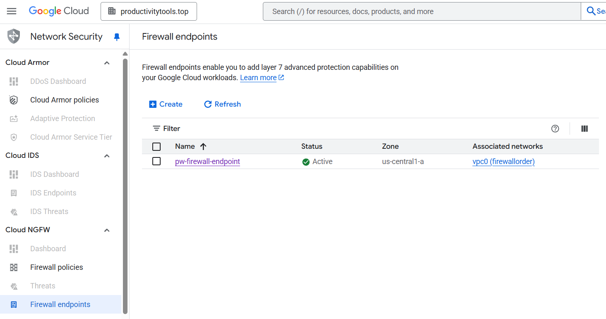
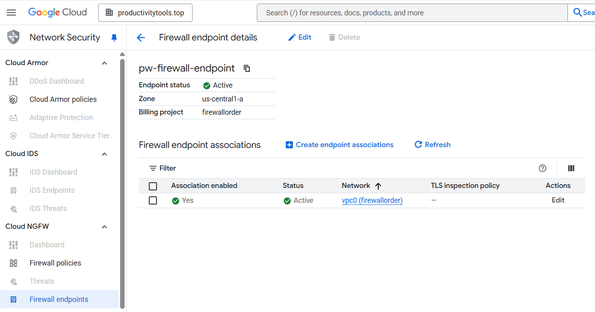

# Firewall endpoints

From google [docs](https://cloud.google.com/firewall/docs/about-firewall-endpoints):
- Firewall endpoints perform Layer 7 firewall inspection on the intercepted traffic.

Firewall endpoint is one of the component of the **Intrusion detection and prevention** service. It redirects traffic to the Palo Alto software that performs packet analysis (malware, spyware, and command-and-control attacks). 

To make the functionality (**Intrusion detection and prevention** ) working following services needs to be configured:
- Firewall endpoint
- [Security profile](https://cloud.google.com/firewall/docs/about-intrusion-prevention)

## Similar products

### Firewall endpoints (Intrusion detection and prevention) vs NSI (Network Service integratoin)

GCP offers also NSI service. NSI service does similar thing, but **Intrusion detection and prevention** is managed service and NSI service allows to send packet to the 3rd party solution that user will configure.

## Firewall endpoints (Intrusion detection and prevention) vs IDS Endpoints
IDS endpoints are the Detection system and Firewall endpoint are prevention
- Detection - Cloud will detect threat and inform on the dashboard but do not influence the traffic
- Prevent - Clouw will prevent threat

## Screens

### Create Firewall Endpoint screen

### Create Firewall Association screen

### Firewall endpoints list

### Firewall endpoint details

