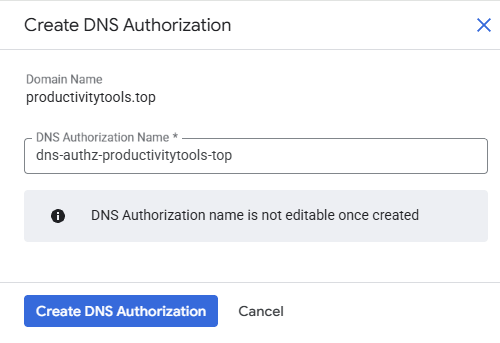

# Secure Web Proxy

Service allow to securely connect to the internet from the VMs in the cloud.

Typical scenario: We have VM without the external IP. That means that VM does not have access to the Internet. We do not want to assgn the IP as then VM would be exposed to attacks. 

We can create **Secure Web Proxy** that will allow VM to acces the internet. 

