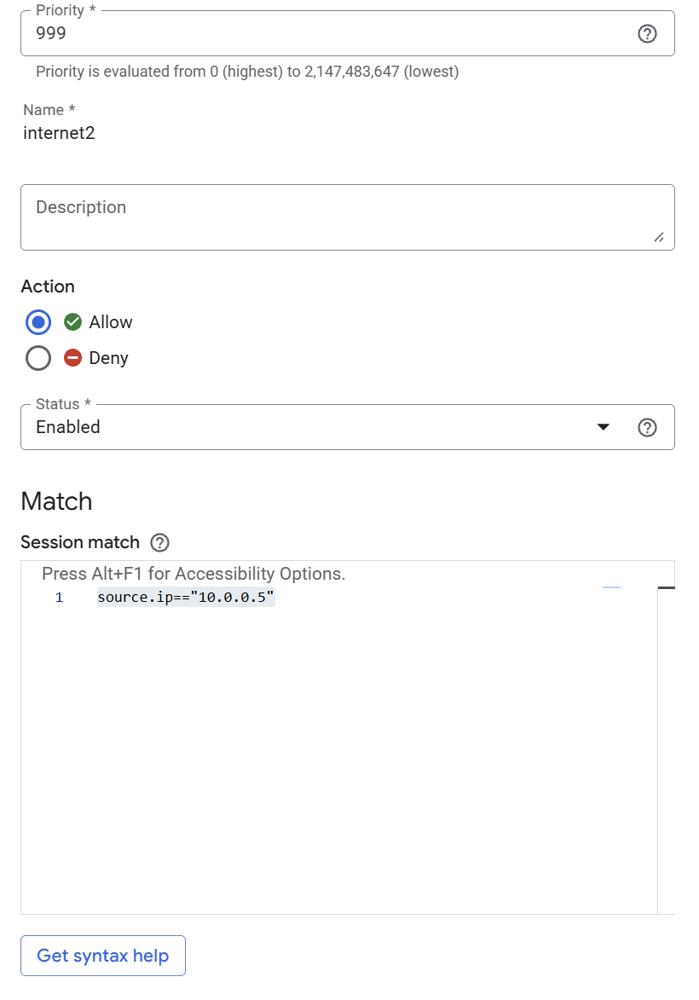
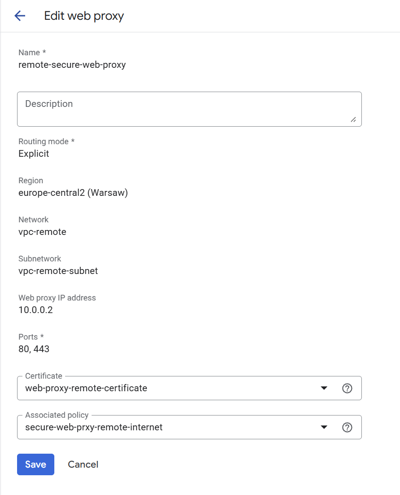

# Secure Web Proxy


## Subnet for the proxy
Google does not run the proxy in your subnet, to use it we need to create special subnet in the network. 
It means that we need always to have two sub-networks
- one where VM will be placed
- second only for the Web Proxy

In the VPC details on the Subets tak, click **Add subnet**


The important configuration to select is **Regional Managed Proxy**. 


## Secure web proxy wizard
Service allow to securely connect to the internet from the VMs in the cloud.

Typical scenario: We have VM without the external IP. That means that VM does not have access to the Internet. We do not want to assgn the IP as then VM would be exposed to attacks. 

Secure web proxy is a regional service, that means if we have two subnetworks in different regions we need to create two secure web proxies.


We can create **Secure Web Proxy** that will allow VM to acces the internet. 


Secure web proxy needs certificate to connect with the SSL. 


We need to generate data to validate if we own the domain. 


After clicking DNS authorization, Console provides us data that we should put in the DNS confiruguration.


It is written that we need to create the policy, we will do it in the next step


After creation **Secure Web Proxy** we see that the certificate status is pending, that means that we need o put the correct data in DNS.


When data in the DNS are put, the status of the certificate changes to active


## Secure Web Proxy Policy

To allow VM to access internet we need to create policy.


```
source.ip=="10.0.0.5"

```






# VM Proxy server
VM sill does not have the access to the internet, as we are missing proxy configuration.


After set up proxy we should have the internet.


