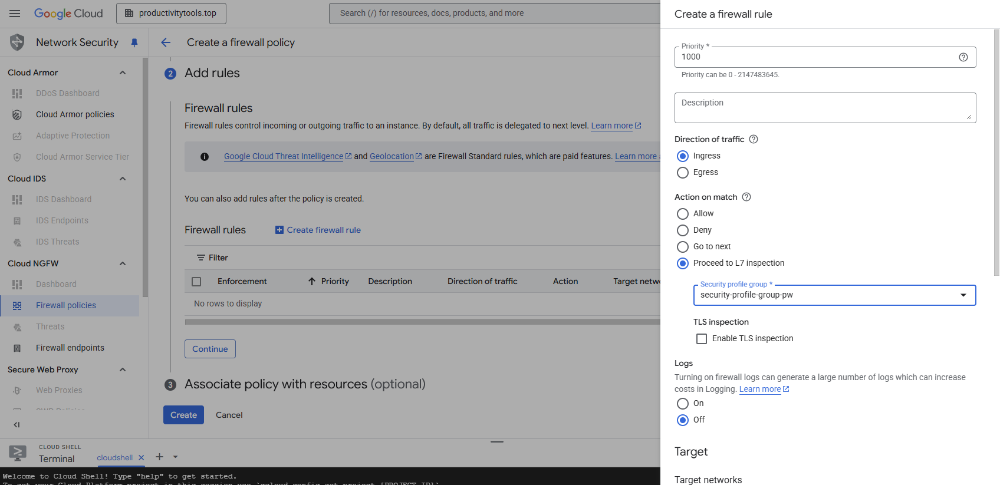
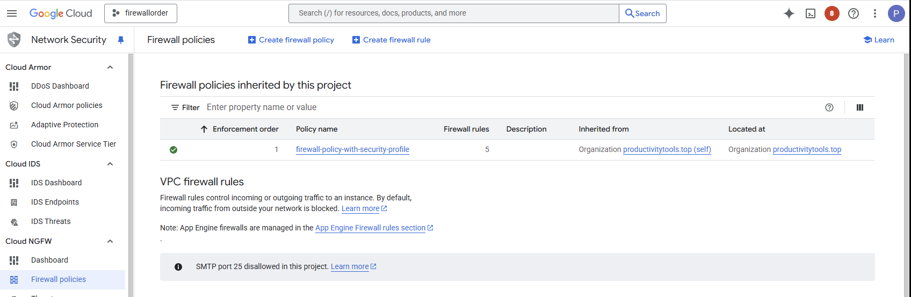
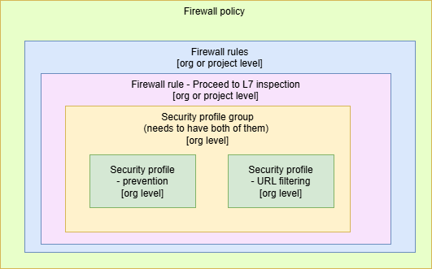

# Security profiles [O]

* This is feature for organization  
* It is placed under Network Security \> Common components \> Security profiles  
* There are two types  of the security profiles  
  * Threat prevention  
  * URL filtering

In the future maybe additionall functionalities will be added. PaloAlto has following [list of items](https://docs.paloaltonetworks.com/network-security/security-policy/administration/security-profiles): URL Filtering, File Blocking, Data Filtering, AI security.

### Security profile group

Security profile group is a group of security profiles.

**Security profile group** can be added to the Firewall policy

Firewall policy can be asociated wth organizatino or folder. It means that each project that is child of the organization or the folder will have firewall policy forced. 

The dependency graph:

