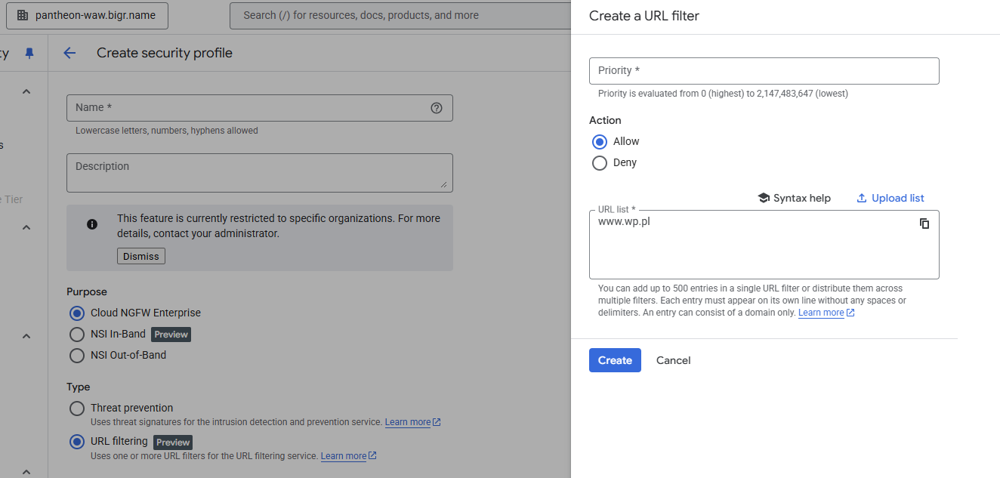
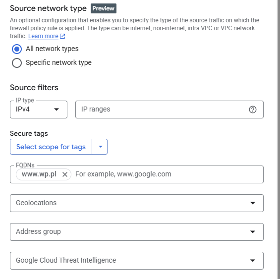

# URL filtering

Functionality allows to filter requests based on the url list. 

**Next Generation Firewall** allows to filter trafic based on the Fully Qualified Domain Name (www.google.com) so this is similar functionality.

What is the difference?

FQDN uses ip resolution and caching. So if domain IP changes frequently functionality does not work properly. 

Also the URL filtering in the future will allow to add the more detailed url  (www.google.com/maps).

When to use:
- If we have under one domain multiple sites (google.com/maps, google.com)
- If site that we would like to block is hosted under multiple IPs or the IP of the page changes 

