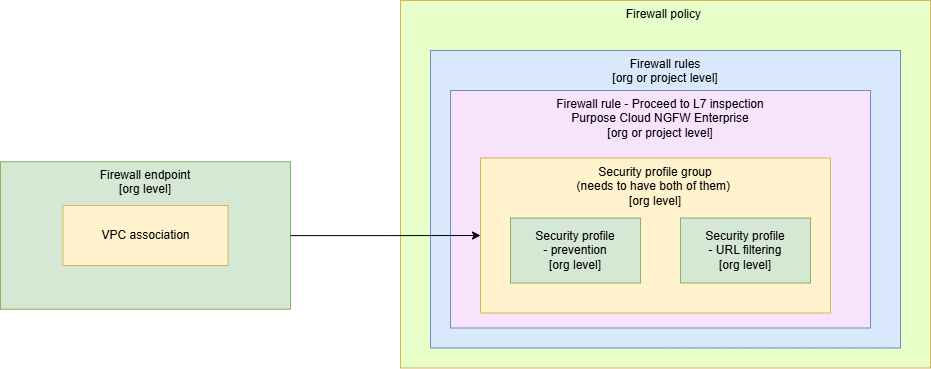
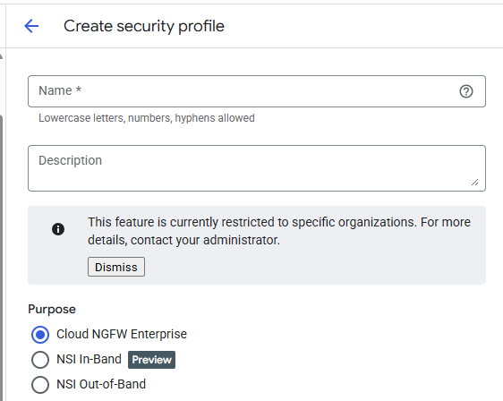
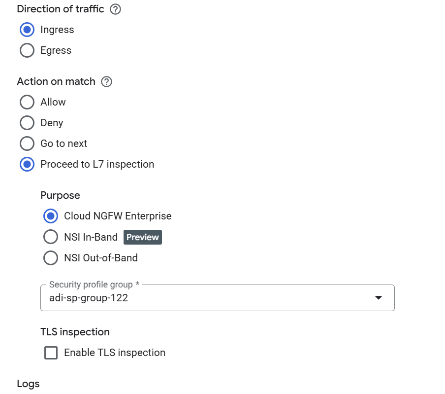
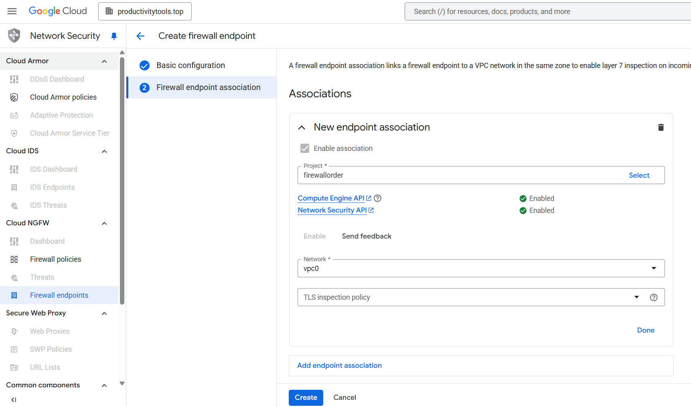

# Threat prevention

When functionality is enabled the traffic from the network is redirected to google own project with the Palo Alto services installed. Palo Alto performs inspection of the traffic and blocks or report risky traffic. 

To make **Intrusion detection and prevention** functionality work multiple components need to be configured:
- Firewall Endpoint
    - Firewall endpoint association
- Firewall Policy 
    - Firwall policy **Proceed to L7 inspection** rule
- Security profile
- Security profile group

- Firewall endpoint - first firewall endpoint on the organization level needs to be configured and one or more VPC needs to be associated with it 
- [Security profile](https://cloud.google.com/firewall/docs/about-intrusion-prevention) - Next security profile needs to be confirgured with the **Cloud NGFW Enterpise option**

- Firewall policy rule - **Proceed L7 inspection**

### Firewall endpoint [org level] configuration
    - Region
    - Zone
    - Name - px-firewallendpoint
    - Billing project
    - [Association to project]
    - [Association to network]

## Similar products

### Firewall endpoints (Intrusion detection and prevention) vs NSI (Network Service integratoin)

GCP offers also NSI service. NSI service does similar thing, but **Intrusion detection and prevention** is managed service and NSI service allows to send packet to the 3rd party solution that user will configure.

### Firewall endpoints (Intrusion detection and prevention) vs IDS Endpoints
IDS endpoints are the Detection system and Firewall endpoint are prevention
- Detection - Cloud will detect threat and inform on the dashboard but do not influence the traffic
- Prevent - Clouw will prevent threat

## Screens

### Create Firewall Endpoint screen

### Create Firewall Association screen

### Firewall endpoints list

### Firewall endpoint details

## Firewall Endpoint configuration

To 

