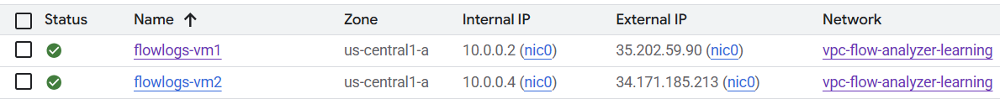

# Logs explorer

Logs are the raw information about events in the GPC that are often used by the networking services.

## Exercise

- 2 VMs
- On both VMs Apache deployed
- Page exposed to the internet



Traffic executed in the loop from the PC that the gateway (external IP) is 83.24.101.214.

```
1..10000 | % { Invoke-WebRequest -Uri "http://35.202.59.90/" -UseBasicParsing }
```

Flow log contains a lot of information. Full log below.

### Connection - 5 tuple
One of th emost important networkng log it shows the 5 tuple information about source and destination.

- Destination ip is equals the ip of the VM in the GPC
- Source is equal external IP of the PC that initated the call.

```
connection: {
    dest_ip: "10.0.0.2"
    dest_port: 80
    protocol: 6
    src_ip: "83.24.101.214"
    src_port: 50035
}
```

### Instance

This give us important information about the VPC that the target VM uses and the location of the target VM

```
instance: {
    project_id: "pwujczyklearning"
    region: "us-central1"
    vm_name: "flowlogs-vm1"
    zone: "us-central1-a"
}
```

### Remote location
This list the basic information about the caller, it allow us to draw the map with the connections

```
remote_location: {
    city: "Warsaw"
    continent: "Europe"
    country: "pol"
    region: "Masovian Voivodeship"
}
```


## Full json
```
{
  "insertId": "152oj5uf5virlx",
  "jsonPayload": {
    "rule_details": {
      "direction": "INGRESS",
      "reference": "network:vpc-flow-analyzer-learning/firewallPolicy:flow-logs-policy",
      "source_range": [
        "0.0.0.0/0"
      ],
      "action": "ALLOW",
      "priority": 100,
      "ip_port_info": [
        {
          "port_range": [
            "80"
          ],
          "ip_protocol": "TCP"
        }
      ]
    },
    "instance": {
      "region": "us-central1",
      "vm_name": "flowlogs-vm1",
      "project_id": "pwujczyklearning",
      "zone": "us-central1-a"
    },
    "disposition": "ALLOWED",
    "connection": {
      "dest_port": 80,
      "src_ip": "83.24.101.214",
      "protocol": 6,
      "src_port": 50035,
      "dest_ip": "10.0.0.2"
    },
    "vpc": {
      "vpc_name": "vpc-flow-analyzer-learning",
      "project_id": "pwujczyklearning",
      "subnetwork_name": "subnet1"
    },
    "remote_location": {
      "region": "Masovian Voivodeship",
      "city": "Warsaw",
      "continent": "Europe",
      "country": "pol"
    }
  },
  "resource": {
    "type": "gce_subnetwork",
    "labels": {
      "subnetwork_name": "subnet1",
      "project_id": "pwujczyklearning",
      "location": "us-central1",
      "subnetwork_id": "9134086949801188542"
    }
  },
  "timestamp": "2025-09-30T09:01:07.553376164Z",
  "logName": "projects/pwujczyklearning/logs/compute.googleapis.com%2Ffirewall",
  "receiveTimestamp": "2025-09-30T09:01:12.496460041Z"
}
```