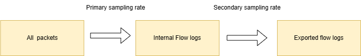
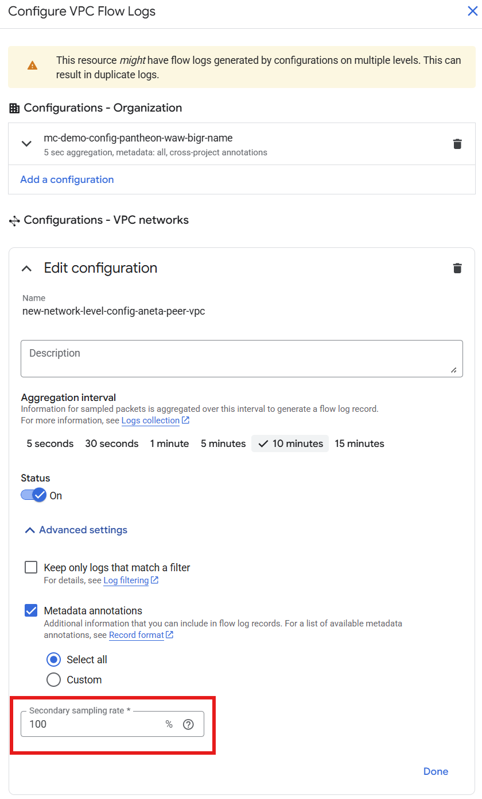

# VPC Flow Logs

It samples traffic in your network. 

The logs always contain 5 tuples:

- Source IP
- Source Port 
- Destination IP
- Destination Port 
- Protocol  

Logs can contain also additional metadata:
- Gateway (location, name, VPC, etc.)
- GKE (cluster, pod, service, etc.)
- GCE Instance (region, name, zone, MIG, etc.)
- Geographic (ASN, city, continent, etc.)
- VPC (network name, subnetwork name, etc.)
- Load Balancer (type, scheme, backend, etc.)
- PSC (endpoint, attachment, reporter, etc.)

## Sampling

- First GCP samples the data, the sampling rate cannot be controled
- The second sampling can be configured

The secondary sampling can be decreased to limit the storage used by the logs. 

