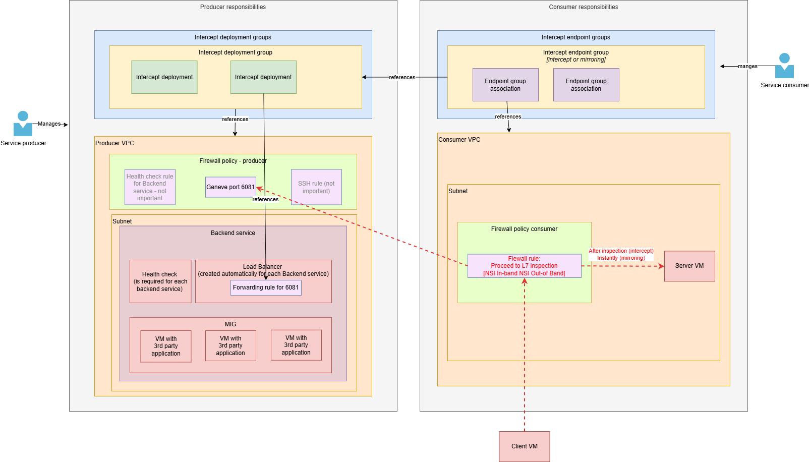
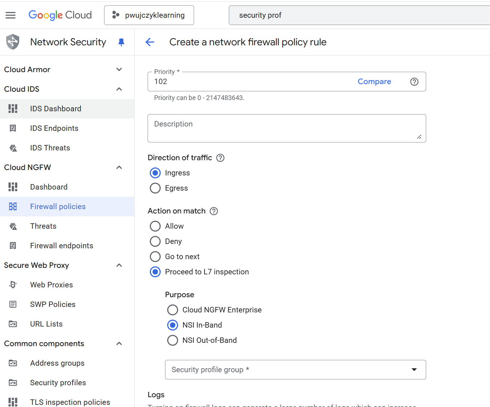

# Cloud Network Security Integration

[Cloud documentation](https://cloud.google.com/network-security-integration/docs/nsi-overview)

Firewall in GCP allows to filter traffic based on the technical properties like IP, port etc. It does not allow to do the request content analysis.

**Network Security Integration**  gives an option to put a software between VMs that do the analysis. The software can be a decision point (in-band/intercept) or a monitoring application (mirroring/out-band)

Examples:

- Company would like to validate if employees does not send any confidential information to their private emails. They set up in-band software that scans the attachments send and block the requests if needed.
- The company noticed that emails with heavy attachments this strategy does not work as the analysis takes too much time. They implement out-band (mirroring) integration. They allow all the traffic, but in the background they analyze the attachments. If required they send email to the proper employee.

## Solution
GCP does not offer packet analysis tools. GCP allows to deploy custom software on the VM and redirect/mirror traffic to this software.

## Additional terms

- **in-band** - describes a method where control or management signals are sent over the same communication channel as the data itself
-  **out-of-band** - separate, dedicated channel is used for control and management.
- **Prevention system** - the term is used in the context of intercept/in-band of the packets. It increases the time of the request but protects in the real time
- **Intrusion detection system** the term is used in the context of mirroring/out-band of the packets. It analyses packets in the background and performs actions afterwards.
- **Geneve protocol** - To mirror or to redirect data to the 3rd party solution geneve protocol is used, The most important to know that geneve allows to redirect packet in its original state, with all headers and original source and destination ip.
- **Service producer** third-party entity (person, company) that manages the solution. Solution should offer packet inspection. Service producer deploys VM in Intercept deployment group
- **Intercept deployment group** group of VMs used to analyze packets
VM - GCE with software that allows to analyze packets it could be for example a firewall or intrusion detection system

## Producer and consumer confusion

- The design of the functionality defines the **Producer** role as a person who deploys the intercept solution and the Consumer that uses the solution. That makes sense if we look at the whole solution as service that is offered to others
- From the request-response point of view the roles should be different. The producer should be the part that sends the packets, and the consumer the one who receives them and makes decisions based on them.

## Configuration
To use functionality we can list couple major steps
- Create by **service producer person** an infrastrucutre for 3rd party analysis tool: 
   - VPC
   - VMs inside MIG inside Backend service 
   - Firwall with forwarding rules
   - Install the 3rd party solution on the VMs
- Create by **service producer person** intercept/mirroring configuratoin
   - Intercept deployment inside intercept deployment group
- Create by **service consuemer person** resources that should be monitored
   - VPC 
   - VMs
   - Intercept endpoint configuratoin
   - Firwall rule that will redirect traffic to the 3rd party solution

## Resources diagram

Below is a diagram of all components that are needed to configure the solution.

- **Backend service**  is responsible for the routing traffic to the MIGs. Without Backend service MIGs are a group of the VMs that do not act as one service.
- **Load Balancer** for the Backend service is created automatically
- **Forwarding rule** is needed for the backend without it traffic to the VMs is not redirected. In our case the Backend serivice Load Balancer will receive Geneve request on port 6081.

### Flow

- When request is send to the Server it Firewall rule encapsulates request into Geneve packet and sends it to Producer VPC
- Backend VMs analyze the packed and made the decision if it should be allowed or rejected ***THIS IS TO be confirmed***

