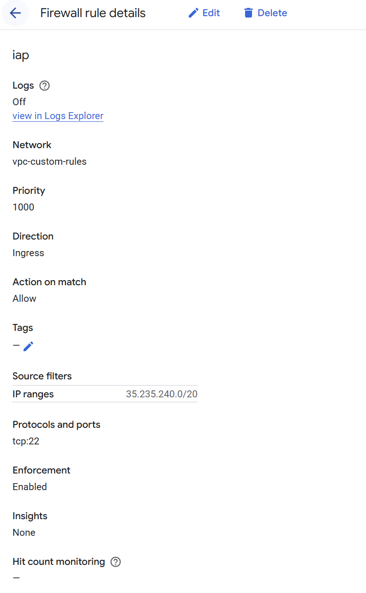

# Allow custom

During VPC creation in the legacy rule we have the option to create **allow-custom** rule. The rule is autofilled after we provide the range for the subnetwork and its goal is to allow communication between all VMs in the network. 

This short tutorial will validate this behaviour. 


## VPC without any rules
- VPC without any rules will be created (only for the IAP)
- Two VMs will be created in the VPC
- Ping command will be tested

Expected result timeout
## VPC with custom rules
- VPC with allow-custom rule wil be created 
- Two VMs will be created in the VPC
- Ping command will be tested

Expected result - success 


## VPC without any rules


When we click the **SSH** button in the UI we connect through the Google proxy (Identity-Aware proxy) and we need to add rule to the firewall to allow connections from **35.235.240.0/20** that is Google proxy server. 



When we try to ping another machine in the network where custom connections are not added we face timeout. 

```
ping -c 5 -W 2 10.0.0.3
```


On the other hand for the VPC where Custom rules were added the connection works:

