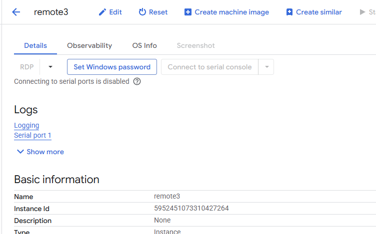

# Identity Aware Proxy

## SSH 

We can access securely VM using ssh even when VM does not have public IP. 


To do it we need to create firewall rule that allows traffic from internal google services that act as a proxy to our servers. 


[Add firewall rule that will allow traffic from the range](35.235.240.0/20) ```35.235.240.0/20```


When rule is created we can use the command to open ssh connection.

```
gcloud compute ssh iam-vm --tunnel-through-iap --zone us-central1-a
```


## RDP

For RDP situation is similar. 

The firewall rule needs to open 3389 port

 


We need to create a tunnel on our pc to the google servers:

```
gcloud compute start-iap-tunnel remote3 3389 --local-host-port=localhost:9876 --zone=europe-central2-aremot
```


And connect to the localhost


We can take password from the VM details




