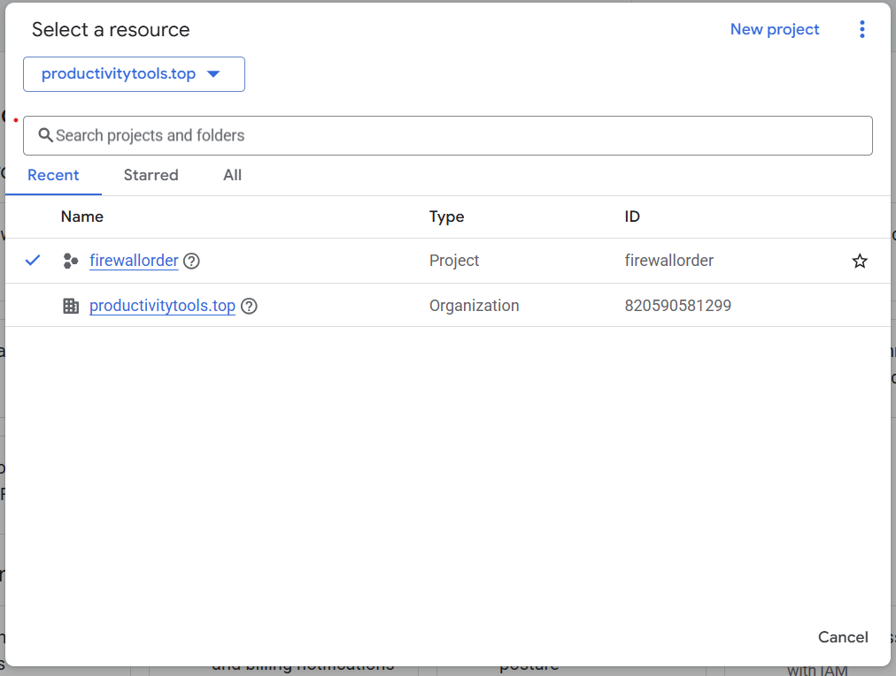
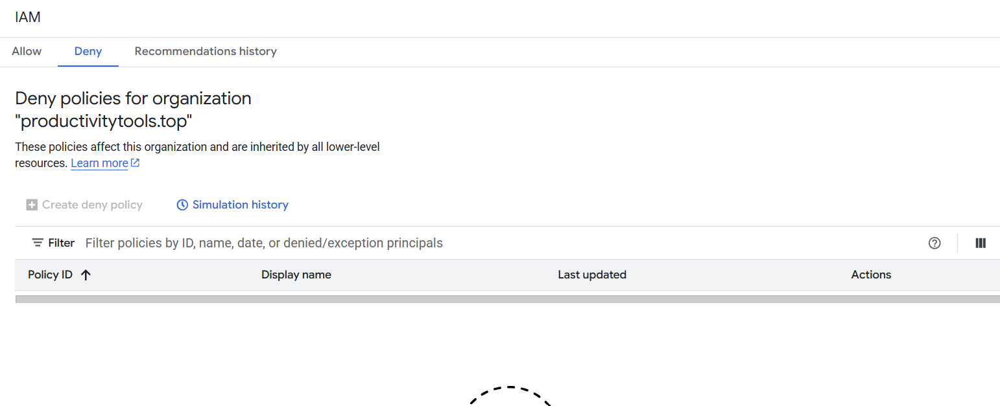
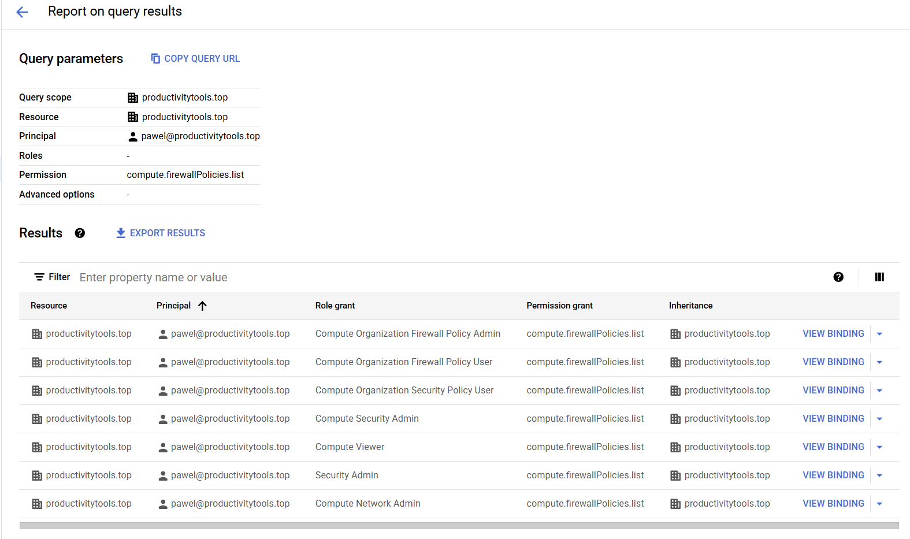

# Organization policy 

On te account pawel@productivitytools.top I have 
- an organization productivitytools.top
- project firewall order

In the firewall policies on the organization level I have one policy **block-80-org-level**

**I cannot do the association to VPC**. Portal complains that I am missing permissions. 

I think I have all permissions needed:

I also do not have any deny permissions

Command in the gcloud says that user misses **compute.firewallPolicies.list**

Quering policy analyzer 

Confirms that user has required rights.

