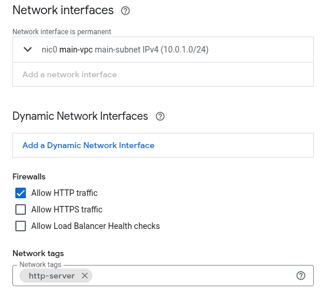
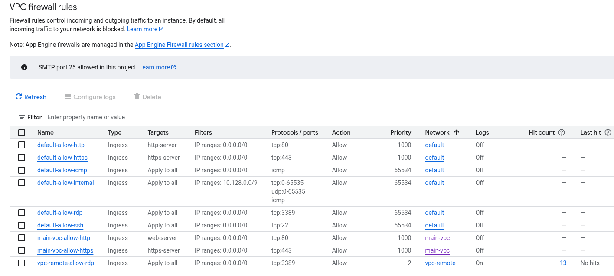

# Tags - Network Tags & Secure tags

GCP offers two types of tags. Both of them we can put as an attribute on VM Secure tags is called **Tags** and network tag is called **Network tag**

## Network tag
Is a simple string that is used in VPC firewall rules. They are placed in the Networking section of the GCE.

User can put everystring in that field. Later value entered can be used in the Firewall rules (legacy not policies).

When checbox will be marked VPC firewall rules will be created automatically. - TO be confirmed, It is for sure not recreated

## Secure tag