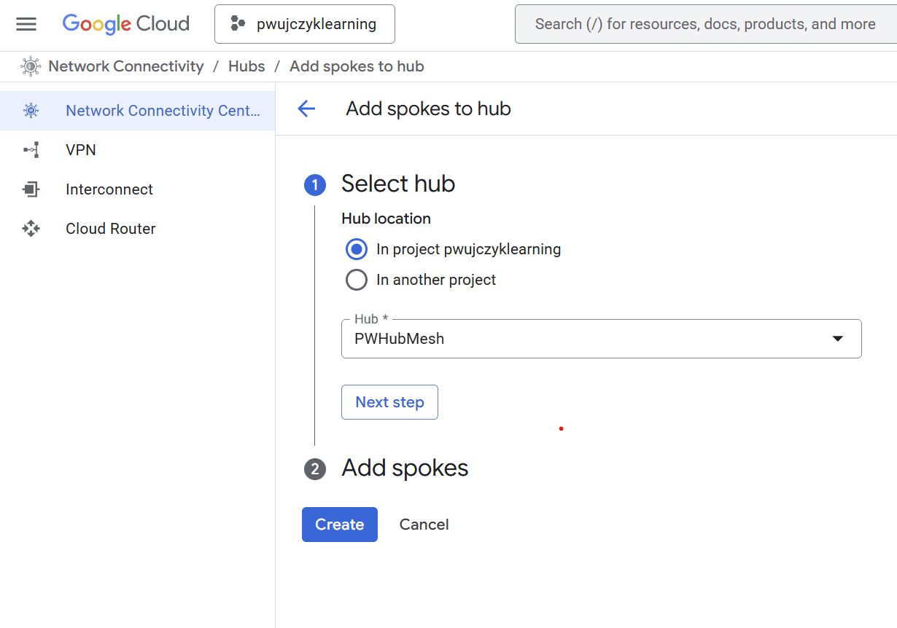

# Network Connectivity


## Preparation

Create two 2 VPCs with VMs inside


```
# variables
export PROJECT="pwujczyklearning"
export REGION="us-central1"
export ZONE="us-central1-a"

export VM1_NAME='vpc1vm'
export VM2_NAME='vpc2vm'

export NETWORK_NAME1="$USER-vpc1-test"
export NETWORK_NAME2="$USER-vpc2-test"
export SUB_NETWORK_NAME1="$USER-vpc1-test-subnetwork"
export SUB_NETWORK_NAME2="$USER-vpc2-test-subnetwork"
```


```
gcloud compute networks create $NETWORK_NAME1 \
    --subnet-mode=custom \
    --mtu=1460 \
    --project=$PROJECT

gcloud compute networks subnets create $SUB_NETWORK_NAME1 \
    --region=$REGION \
    --network=$NETWORK_NAME1 \
    --range=10.0.0.0/27 \
    --enable-private-ip-google-access \
    --project=$PROJECT


gcloud compute networks create $NETWORK_NAME2 \
    --subnet-mode=custom \
    --mtu=1460 \
    --project=$PROJECT

gcloud compute networks subnets create $SUB_NETWORK_NAME2 \
    --region=$REGION \
    --network=$NETWORK_NAME2 \
    --range=10.0.0.0/27 \
    --enable-private-ip-google-access \
    --project=$PROJECT

gcloud compute firewall-rules create ssh-allow \
--direction=INGRESS \
--priority=1000 \
--network=$NETWORK_NAME1 \
--action=ALLOW \
--rules=tcp:22 \
--project=$PROJECT 

gcloud compute firewall-rules create ssh-allow \
--direction=INGRESS \
--priority=1000 \
--network=$NETWORK_NAME2 \
--action=ALLOW \
--rules=tcp:22 \
--project=$PROJECT 


gcloud compute instances create $VM1_NAME \
    --image-project=debian-cloud \
    --image-family=debian-11 \
    --machine-type=e2-micro \
    --zone=$ZONE \
    --network-interface="subnet=$SUB_NETWORK_NAME1,no-address" \
    --project=$PROJECT 

gcloud compute instances create $VM2_NAME \
    --image-project=debian-cloud \
    --image-family=debian-11 \
    --machine-type=e2-micro \
    --zone=$ZONE \
    --network-interface="subnet=$SUB_NETWORK_NAME2,no-address" \
    --project=$PROJECT 


```
gcloud compute instances delete $VM2_NAME \
    --zone=$ZONE \
    --project=$PROJECT \
    --quiet

gcloud compute instances delete $VM1_NAME \
    --zone=$ZONE \
    --project=$PROJECT \
    --quiet

gcloud compute networks subnets delete $SUB_NETWORK_NAME1 \
    --region=$REGION \
    --project=$PROJECT \
    --quiet

gcloud compute networks subnets delete $SUB_NETWORK_NAME2 \
    --region=$REGION \
    --project=$PROJECT \
    --quiet

gcloud compute networks delete $NETWORK_NAME1 \
    --project=$PROJECT \
    --quiet

gcloud compute networks delete $NETWORK_NAME2 \
    --project=$PROJECT \
    --quiet

```

## Creating the Hub 

- Mesh topology
- Start topology

- [Private Service Connect](../network-services/private-service-connect/index.md) connection propagation


## Creating spoke




