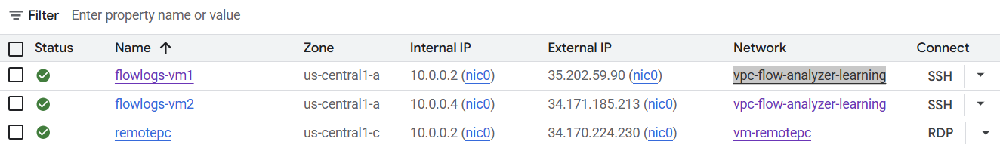
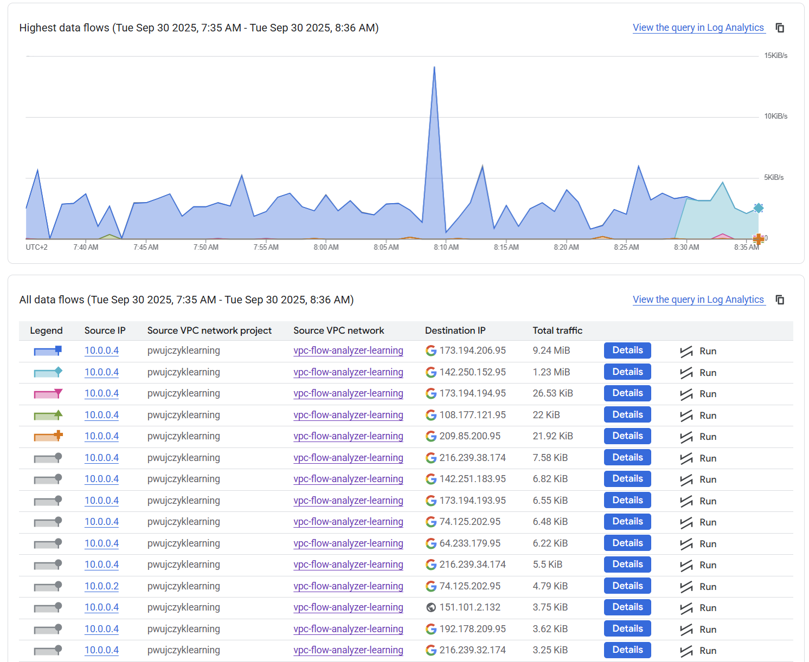
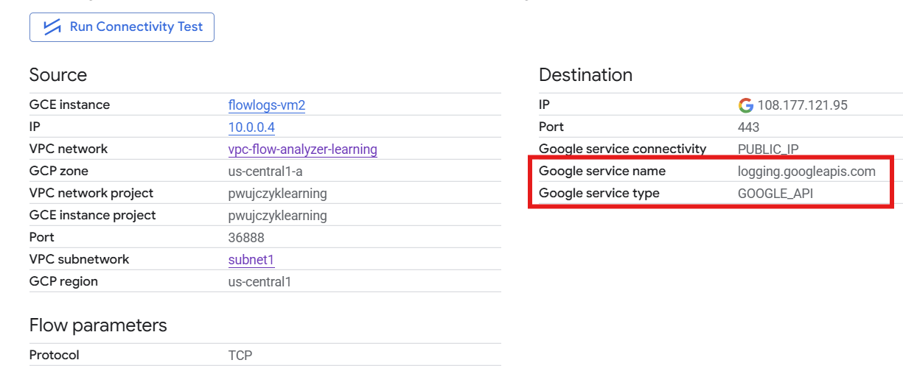
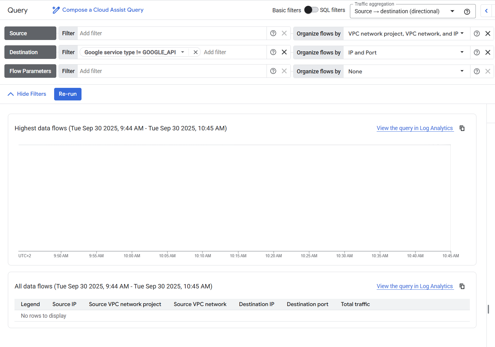

# Flow Analyzer

Flow analyzer displays information about bytes and latency in the network. It allows to analyze how much data is send and received by given resource. 

To use Flow analyzer customer needs to enable **VPC Flow logs**.

Flow Analyzer is build on top of VPC flow logs and sends queries to Log analitycs. Flow analyzer is a tool that generate complex queries in easy to understand UI. It also queries Log analitics and displays results in chart and table.

## VPC Flow logs
Logs gather samples of the traffic in the VPC. The raw data is available in Cloud Logging. 

Based on cloud logging additional functionality is available - Log analitycs. That functionality allows us not only to query data, but also aggregate it (similar to Flow analyzer, but with more options and with raw interface). If we want to use **Log analytics**  need to **Upgrade to use Log analitycs** the bucket.

## Flow analyzer - Example

The example uses
- 2 VMs
- On each VM Apache is installed
- Pages from both VMs are exposed to the Internet

### No traffic

If VM does not have any traffic, the majority of the traffic is Google internal traffic. 
The Google internal traffic is the communication usually initated by the VM for example to send the logs to Flow logs. 

### Google Logging traffic

When we check the details of the traffic we see that the destination is the [logging.googleapis.com](https://cloud.google.com/logging/docs/reference/v2/rest)

If we filter google api the flow logs should be empty

