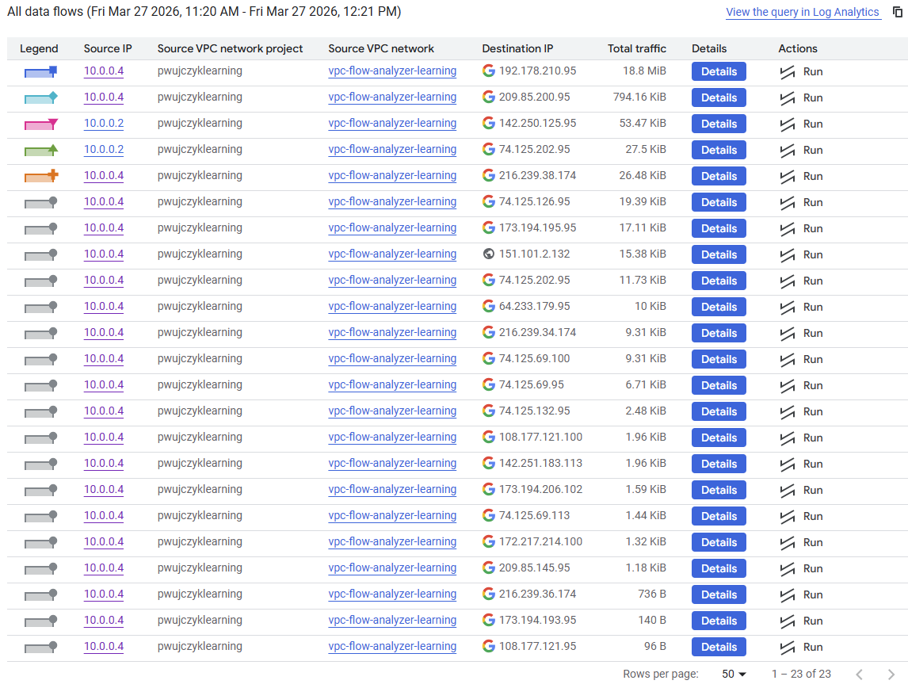
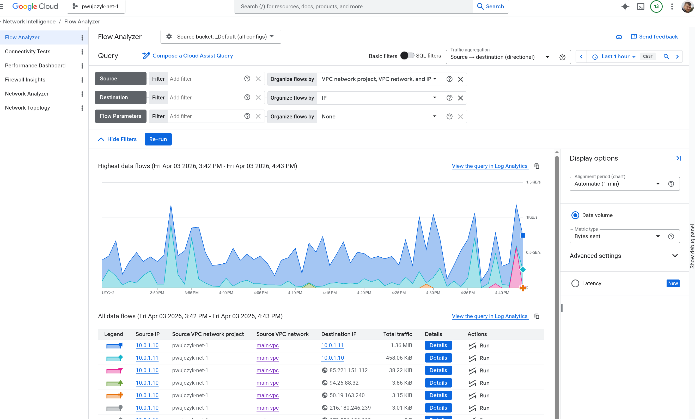

# Flow Analyzer - Traffic Analysis

Following traffic does not have a lot of traffic, and majority of the traffic is data send to monitoring and logging tools




### 192.178.210.95,209.85.200.95, 74.125.132.95 - Google Service
This is the traffic to the monitoring.googleapis.com. In the details it is written that it is traffic that reaches public api, but the traffic does not leave the google network. 

Metrics like CPU or RAM utilization are collected. We can review them in the **Cloud monitoring**.

We can review raw data in the **Metrics explorer** (**Monitoring** -> **Metrics explorer**)


## Two VMs example

For the next example let us create two [2VMs that request data from each other](https://github.com/pwujczyk/ProductivityTools.GoogleCloud.Terraform/tree/main/001.two-vms-exposed-to-internet)


To generate data:
```
1..100 | ForEach-Object { Invoke-WebRequest -Uri "http://34.57.11.220/" -UseBasicParsing }
```

We see that two VMs calling each other and we see also the ping line done from my computer. 



