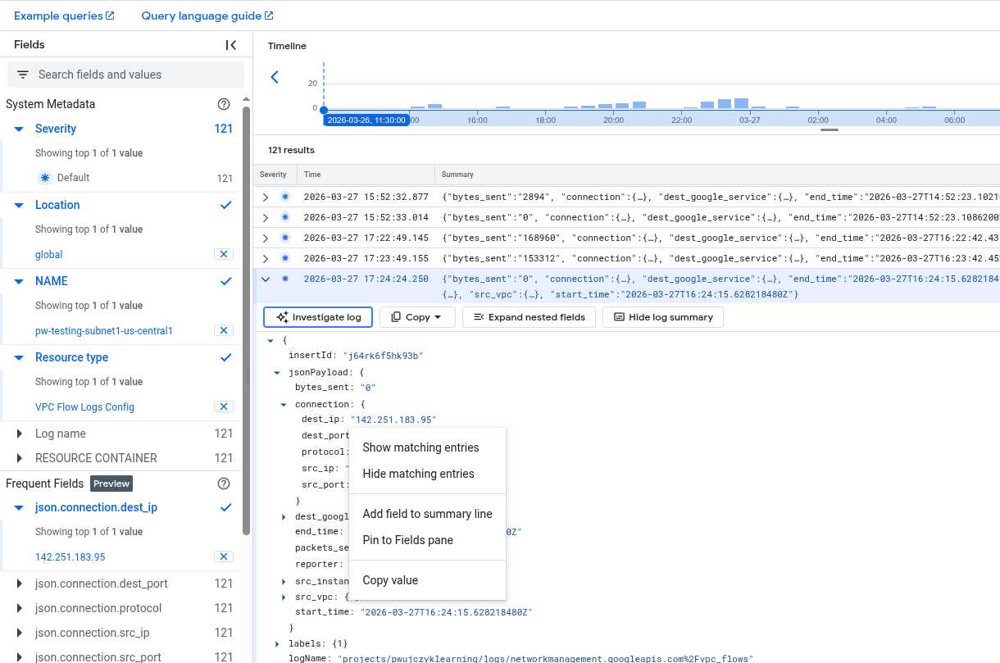
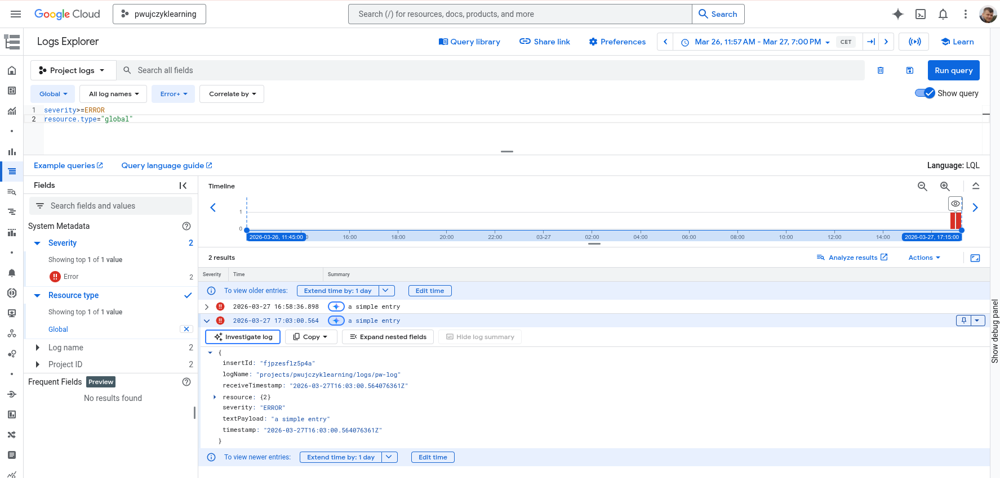
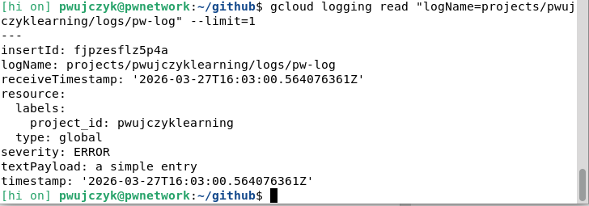

# Logs Explorer

Logs Explorer is a tool that allows you to query and analyze logs in Cloud Logging. It is a web-based tool that allows you to query and analyze logs in Cloud Logging. 

## Syntax

To query logs explorer we use simple syntax ```key=value``` we do not use any select.
We even do not need to use AND between key value pairs. 

Examples

```
logName="projects/pwujczyklearning/logs/pw-log"
jsonPayload.connection.dest_ip="142.251.183.95"
```

## Bags of logs
Cloud organizes logs into *bags*. They are called Resource types. for example
- VPC Flow Logs Config - VPC logs used for example by **Flow Analyzer**
- VM Instance  lgos from instances (we can choose instance) 

## Chose values to show
If we want to see specific values in the rows from the json that is returned, we need to open the log click on the value and choos **Add field to summary line** option.



## Sending logs to Cloud Logging
Cloud logging allows to push logs to it 

```
gcloud logging write my-test-log "A simple entry" --severity=ERROR
```
After this command invocation our log will be placed under **Global** resource type



We can also read it through glcoud
```
gcloud logging read "logName=projects/pwujczyklearning/logs/pw-log" --limit=1

```

