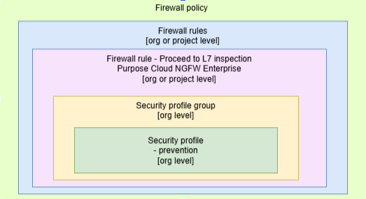
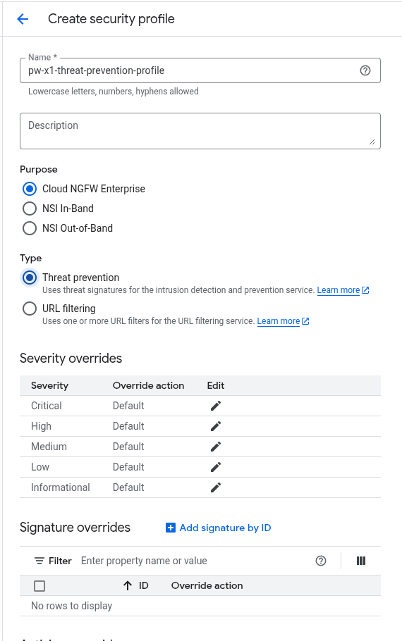
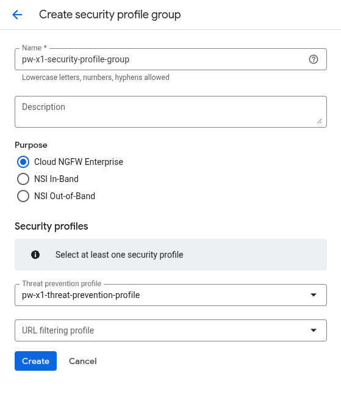
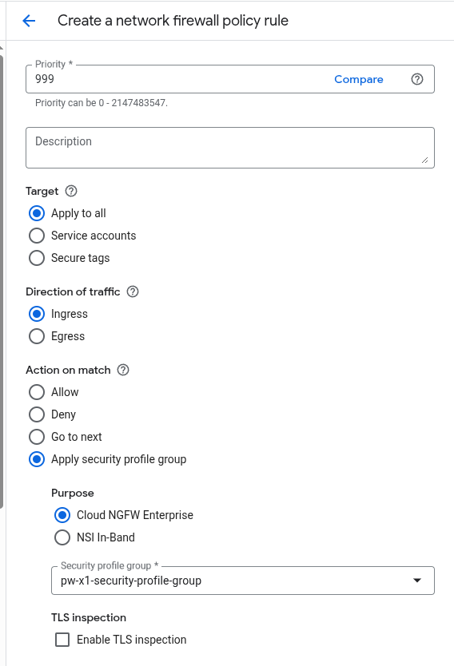
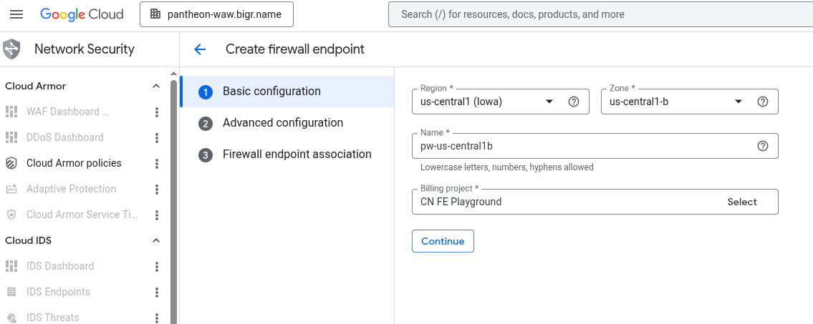
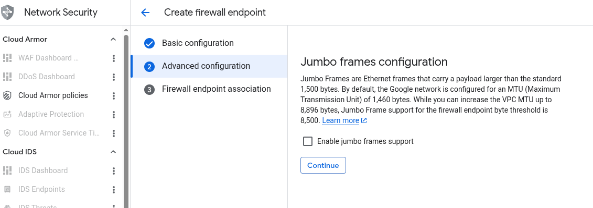
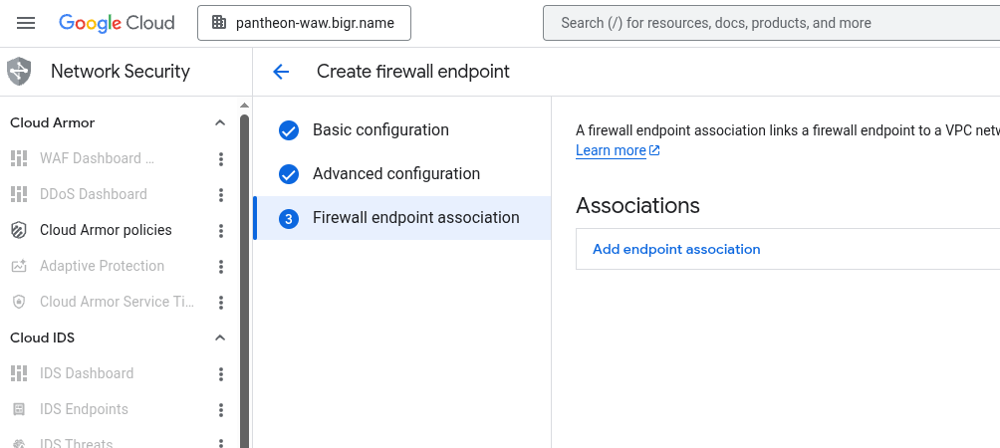

# Create NGFW rule

- To create NGFW firewall rule we need to have Security profile group
- To create Security profile group we need Threat prevention profile

## Create security profile
Security profile currently is avaiable only on the organization level. It will be avaiable on the project level in 2026.

## Create security profile group
Security profile group currently is avaiable only on the organization level. It will be avaiable on the project level in 2026.

## Create firewall rule

## Create firewall endpoint

When firewall endpoint is created, in the tenant project Manage Instance group with the Palo Alot software is deployed. It takes couple minutes.

## Assotiate Firewall endpoint with Network