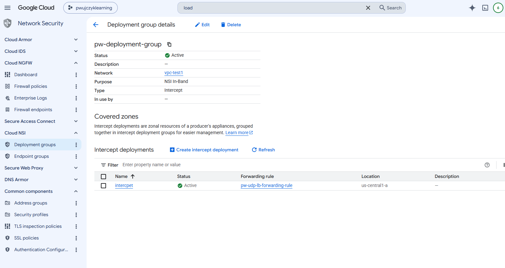

# Deployment groups

Deployment group is the equivalent software that is placed in the tenant project in the managed solution - Threat prevention. 

Producer - the person who is responsible for producing the service creates the deployment group.
Deployment group is a connector between service offered and  Manage Instance group where custom software will be deployed. 

To create deployment we need:
- Load balancer (Nettwork/UDP/internal/pass-through)
    - Health-check
    - Backend group
        - Mig
- Forwarding rule

