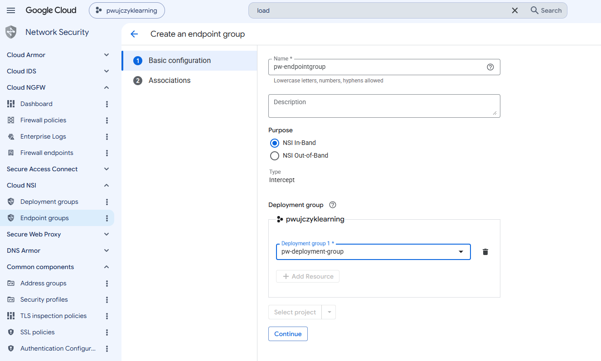
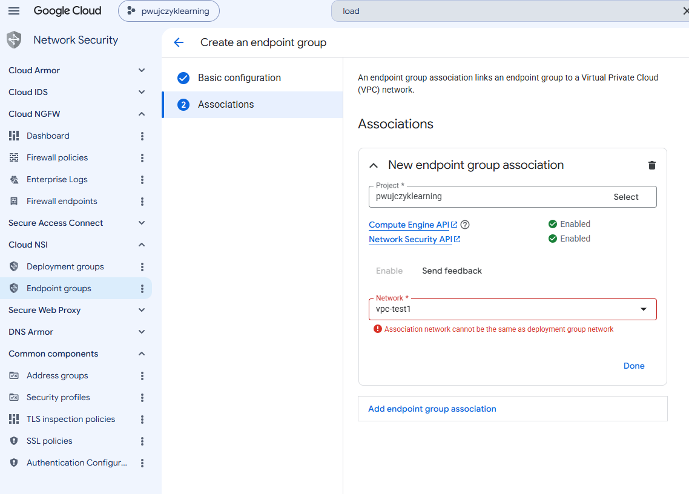

# Endpoint group

This is the consumer part of the Intercept/mirroring functionality. It is deployed inside the consumer network, where the analysis should be aplied.

The network that is assotated on the consumer side cannot be the same as producers

