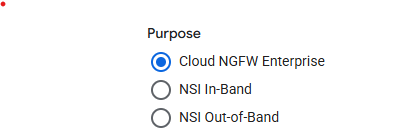
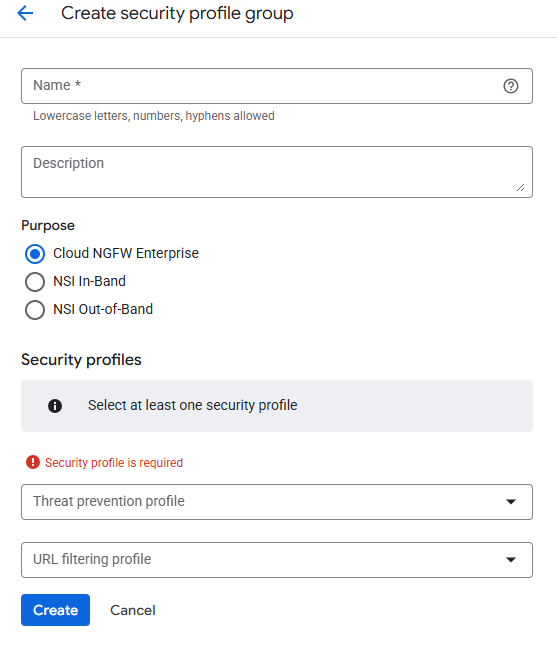
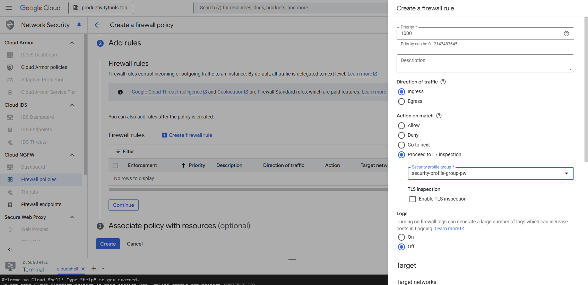
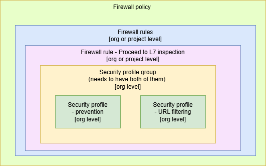

# Security profiles

* Security profile can be created on the organization level, project or folder level
* It is placed under Network Security \> Common components \> Security profiles  

## Security profile

Security profile offers two types of functionalties 
- Enable Next generation firewall for the Firwall policy (Cloud NGFW Enterprise)
- Enable Mirroring or Intercept packets (NSI In-Band and NSI Out-of-Band)

In the NGFW mode it works in provides two functionalities  
  * [Threat prevention](./../services//threat-prevention/index.md) 
  * URL filtering - blocks request to particular URLs

Two other modes:

  * In-band - Intercept - this flow intercept the traffic and sends it to customer tool (placed on VM). The customer tool can decide if the request should be blocked
  * Out-of band - Mirroring - this flow mirrors the traffic but did not block it. It can be used for the post traffic analysis.

In the future maybe additionall functionalities will be added. PaloAlto has following [list of items](https://docs.paloaltonetworks.com/network-security/security-policy/administration/security-profiles): URL Filtering, File Blocking, Data Filtering, AI security.

To use the security profile we need to assign it to the **Security profile group**

## Security profile group

**Security profile group** is a group of security profiles. For the Cloud NGFW the profile group could have **Threat prevention profile** or **Url filtering profile** or both.

For the **NSI In-Band** or **NSI Out-of-band**, **Security profile group** needs reference to intercept or mirroring profile 

To make functionality working user needs to create Firwall rule with the Proceed to L7 inspection option enabled. In this option proper **Security profile group** needs to be chosen. 

# The dependency graph

