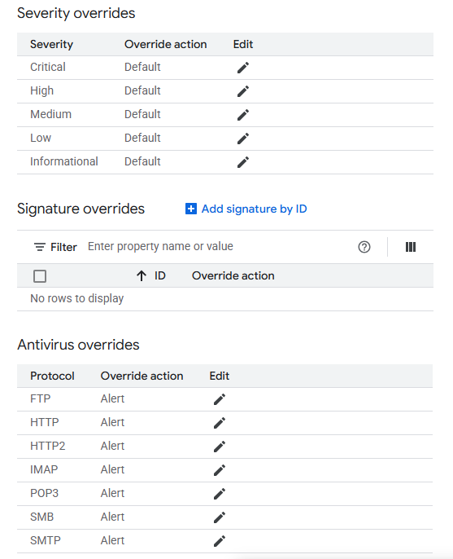
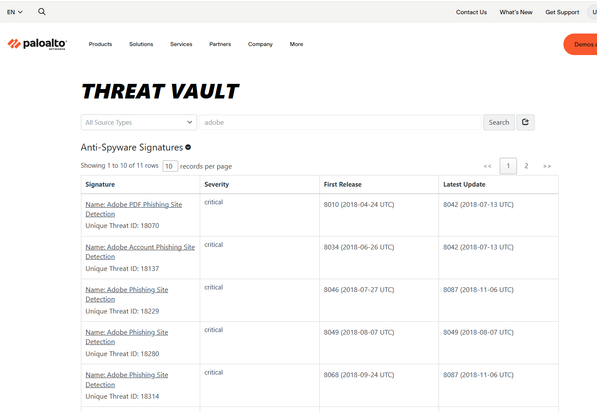
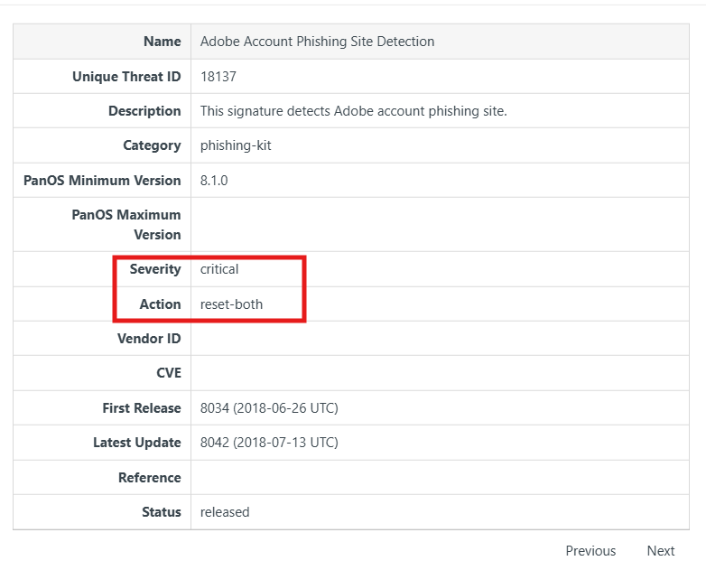

# Threat prevention

When **Threat prevenion** is enabled, all traffic (Eeast-west & North-South) is intercepted automatically. The traffic is send to Palo Alto software that is deployed in the tenant project on the regular VM. 
Palo Alto software performs deep inspection in the application layer. Remark: Palo alto software is hidden behind the Firewall Endpoint. Firewall Endpoint is a zonal resource. It means that our network has multiple subnetworks in different regions, we need to have multiple Firewall endpoints.

In GCP we can only override the actions assigned to threats.

But what are the default actions? To find out we need to create free account on the [Palo Alto networks](https://threatvault.paloaltonetworks.com/)

In the search we can look for the threats

In the details we see the default action and the severity

