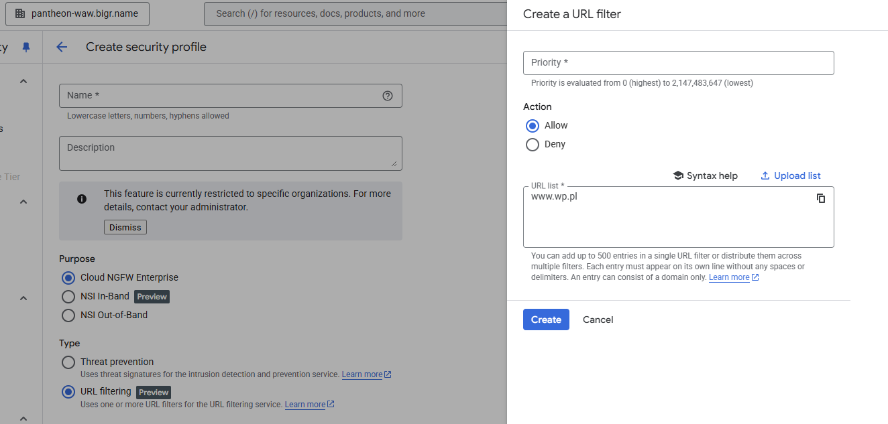
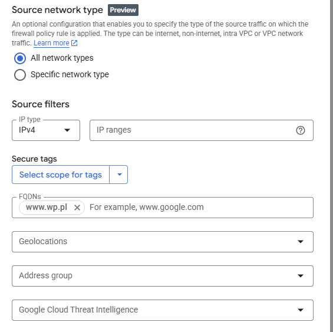

# URL filtering

The functionality works in the same way as Threat prevention, the traffic is intercepted and forwarded for the inspection to the Palo Alot software. 

- For the HTTP, host from the header is used for the inspection
- For the HTTPS, SNI (Server Name Indication), that is send in the "Client Hello" message before the connection becomes encrypted.

If customer wants to filter not only based on domain but also on the full path then TLS inspection needs to be enabled. And GCP behaves as a trusted man-in-the-middle. To make it work on all the VMs Google certificate needs to be trusted

**Next Generation Firewall** allows to filter trafic based on the Fully Qualified Domain Name (www.google.com) so this is similar functionality.

### What is the difference?

- FQDN uses ip resolution and caching. So if domain IP changes frequently functionality does not work properly. 

- Url filtering allows wildcards (*.google.com)

- The URL filtering in the future will allow to add the more detailed url  (www.google.com/maps).

### When to use:
- If we have under one domain multiple sites (google.com/maps, google.com)
- If site that we would like to block is hosted under multiple IPs or the IP of the page changes 

