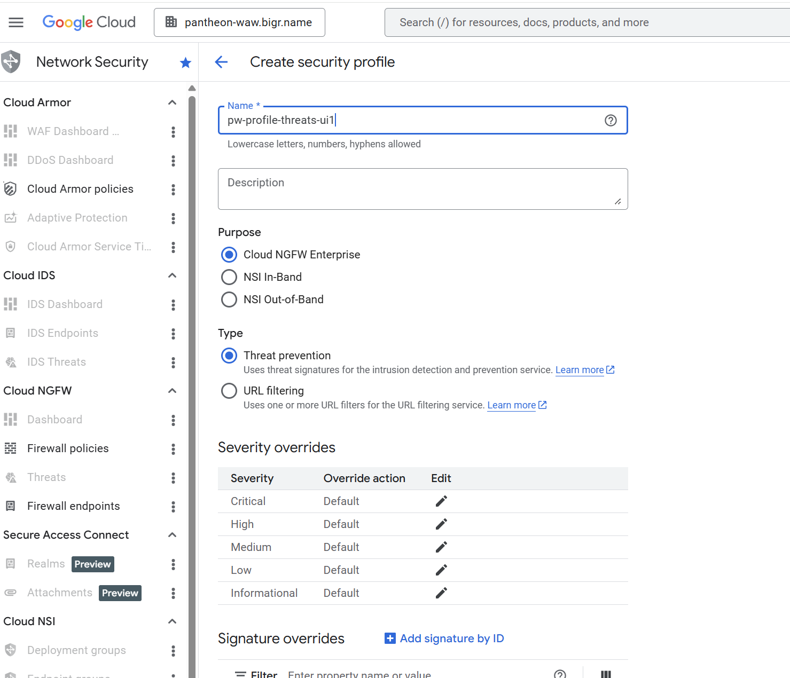
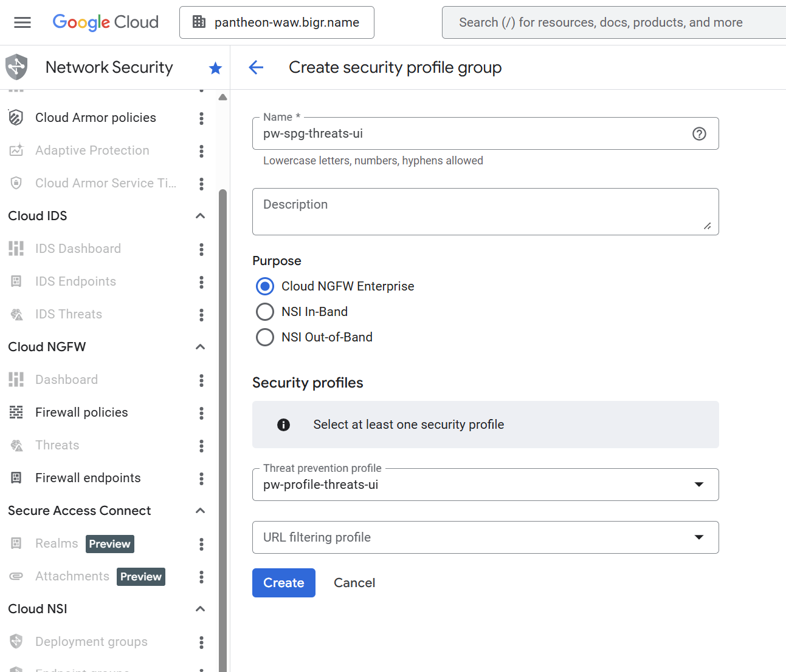

# Threats

Crate secure profile:
```
gcloud network-security security-profiles threat-prevention create pw-profile-threats --organization=255493826784 --project=cn-fe-playground --location=global
```



List secure profile:
```
gcloud network-security security-profiles threat-prevention list     --organization=255493826784 --location=global  --project=cn-fe-playground
```

Create security profile group
```
gcloud beta network-security security-profile-groups create pw-spg-threats --organization=255493826784 --project=cn-fe-playground --location=global --threat-prevention-profile=organizations/255493826784/locations/global/securityProfiles/pw-profile-threats
```

UI


List security profile group:
```
gcloud beta network-security security-profile-groups list --location=global --organization=255493826784
```

Create firewall endpoint

```
gcloud network-security firewall-endpoints create pw-e-thrats --organization=255493826784 --project=cn-fe-playground --zone=us-central1-a --billing-project=cn-fe-playground
```
Check status:
```
cloud network-security firewall-endpoints describe pw-e-thrats --organization=255493826784 --project=cn-fe-playground --zone=us-central1-a
```

```
Parsed [firewall endpoint] resource: organizations/255493826784/locations/us-central1-a/firewallEndpoints/pw-e-thrats
done: false
metadata:
  '@type': type.googleapis.com/google.cloud.networksecurity.v1.OperationMetadata
  apiVersion: v1
  createTime: '2026-03-24T16:21:04.287368899Z'
  requestedCancellation: false
  target: organizations/255493826784/locations/us-central1-a/firewallEndpoints/pw-e-thrats
  verb: create
name: organizations/255493826784/locations/us-central1-a/operations/operation-1774369264250-64dc789b22eb0-46e655aa-17a81ea9
```


### Create network
### Create firewall policy

```
gcloud compute network-firewall-policies create pw-policy --global --project=cn-fe-playground 
gcloud compute network-firewall-policies list --project=cn-fe-playground --global
```