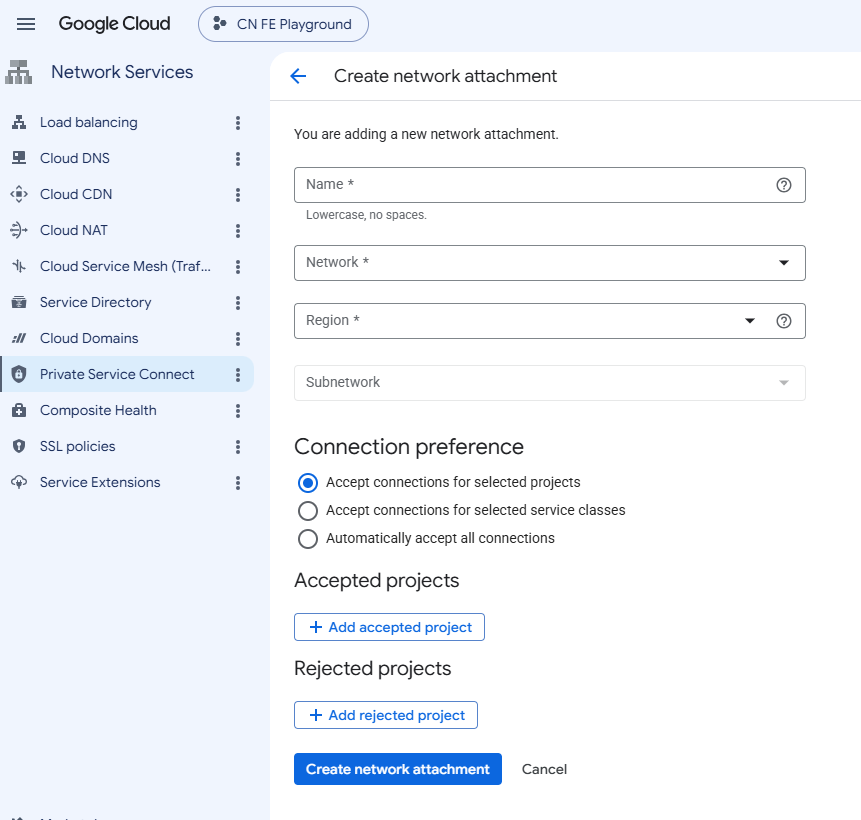
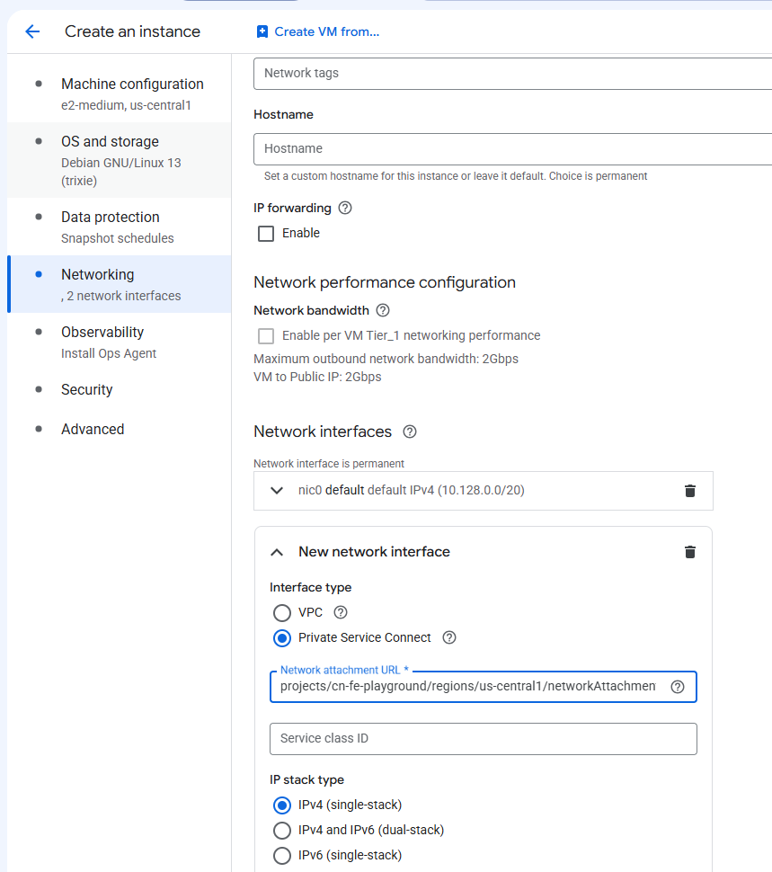

It is resource that allows service provider to attach thier service to the consumer network.

The process of creating the network attachement is as follows:

- The producer shares their project ID or  service class ID with the consumer.
- The consumer creates a NA and adds the producer project ID or service class ID to the accept list.

- They can also create the NA first, and add the producer project ID or service class ID to the accept list later.
- The consumer provides the NA to the producer.
- The producer finally creates a PSC-I (either by launching a VM with a PSC-I or dynamically adding a PSC-I to an existing VM), referencing the consumer NA. 

