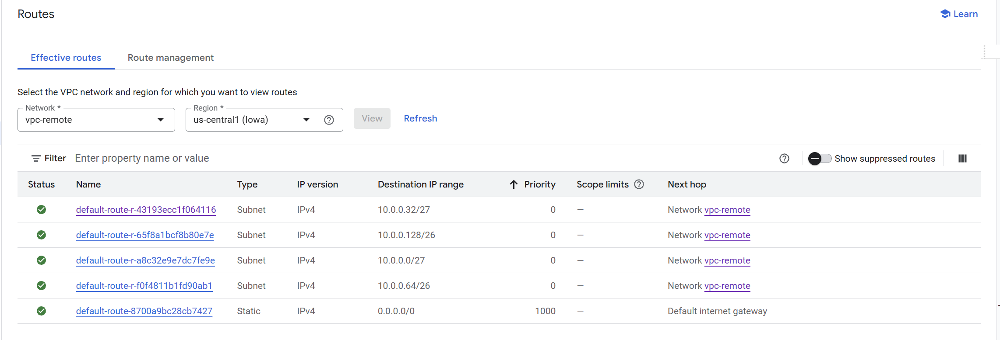

# Routes

Each network has default routes:

- Default Route (0.0.0.0/0) Redirects traffic to the Internet trough Internet Gateway 
- Subnet routes - allow communication inside network (even if they are in the different regions)

On the following screen we see
- 4 routes for 4 different subnets.
- Each subnet has the route with the priority 0 (highest), that make sure that the communication between VMs in the network will work
- In the Next hop Network is listed. At home the next hop is managed by the router, in GCP Andromeda has the table of the physical computer with the mac address where packet should be redirected. 

## Secure web proxy scenario
If we have VMs that does not have external IP and we have Secure web proxy. VMs need to have proxy server configured, that points to the Secure Web proxy. The IP is in the different subnetwork, so when request is done the Next hop to different subetwork is used and later proxy takes control. 
