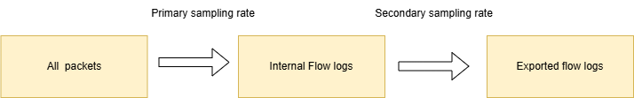
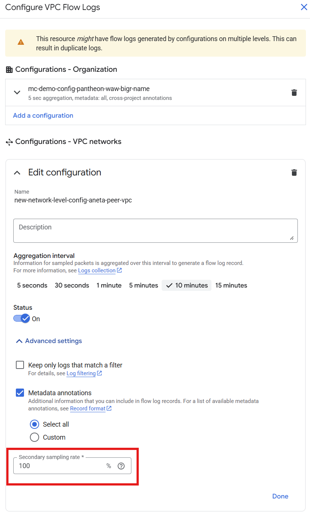
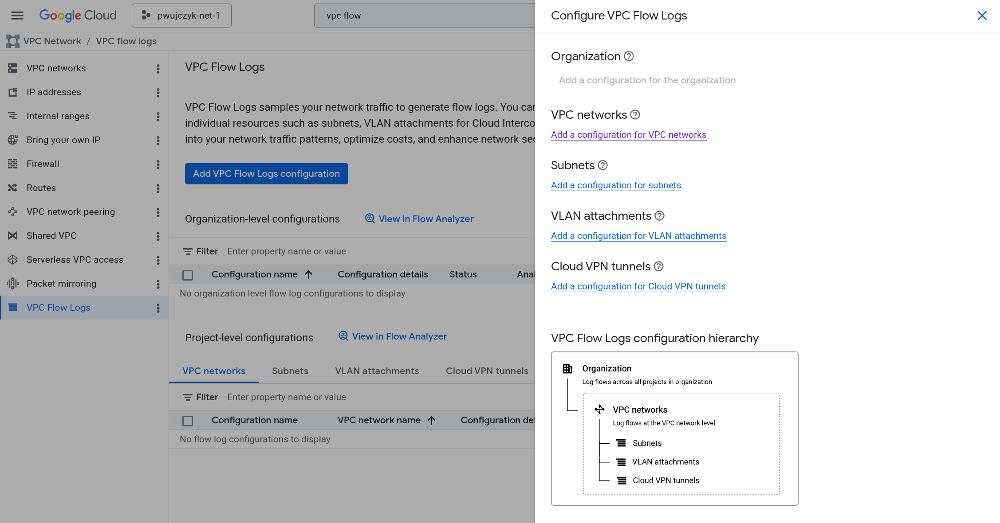
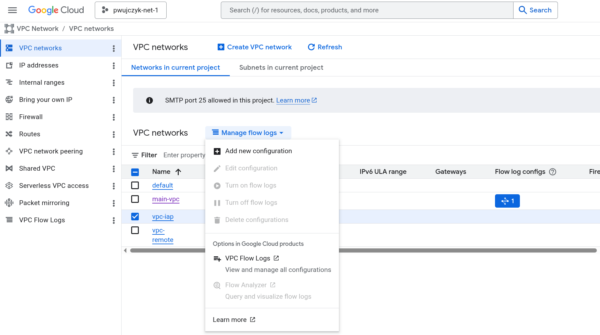
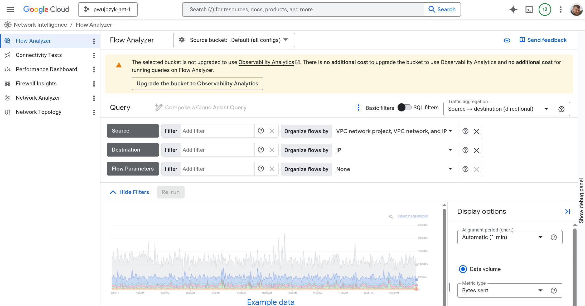

# VPC Flow Logs

It samples traffic in your network. 

The logs always contain 5 tuples:

- Source IP
- Source Port 
- Destination IP
- Destination Port 
- Protocol  

Logs can contain also additional metadata:
- Gateway (location, name, VPC, etc.)
- GKE (cluster, pod, service, etc.)
- GCE Instance (region, name, zone, MIG, etc.)
- Geographic (ASN, city, continent, etc.)
- VPC (network name, subnetwork name, etc.)
- Load Balancer (type, scheme, backend, etc.)
- PSC (endpoint, attachment, reporter, etc.)

## Sampling

- First GCP samples the data, the sampling rate cannot be controled
- The second sampling can be configured

The secondary sampling can be decreased to limit the storage used by the logs. 

## Configuration

Flow logs can be enabled on different levels.

After click on the link, select chosen network and click **Add new configuration** button

Flow logs is analytcs tool and  Observability Analytics needs to be enabled for Flow analyzer to work.

Upgrading to Observability Analytics do not incur any additional cost. 

What happen when you enable it?
Google not only stores the data in the Cloud logging bucked, but also duplicate the data in the BigQuery table. Google does not take any money for that.

