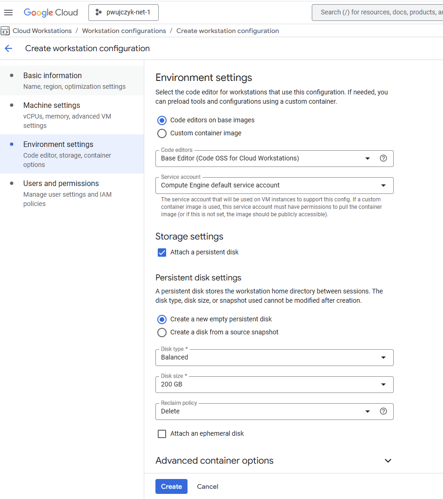

# Cloud workstations


[Cloud workstations service](https://console.google.com/workstations/list?project=cn-fe-playground) allows to code in the cloud.  

## Scenarios
### Github repository edit
Cloud workstations can clone the repository directly from the github and commit data to the remote repository

### Frontend development

For the frontend application we code as in the local machine after running ```npm run dev``` we can open new page where we can test our changes

The following screen shows workstation in the browser with page running.


We see that it listen on localhost:3000 but in reality if we click it proxy page will open proxy page.





## Configuration

### Workstation configuration
First configuration needs to be created. In Code editor Base editor should be chosen 


### Errors:

I added the **Artifact Registry Reader** role to account from the bug that was thrown at me 


I added  **Artifact Registry Reader** role the to the account service-1034282302531@gcp-sa-workstations.iam.gserviceaccount.com as gemini said that this is special workstation account.

I recreated the configuration after it.


## Create new workstation
