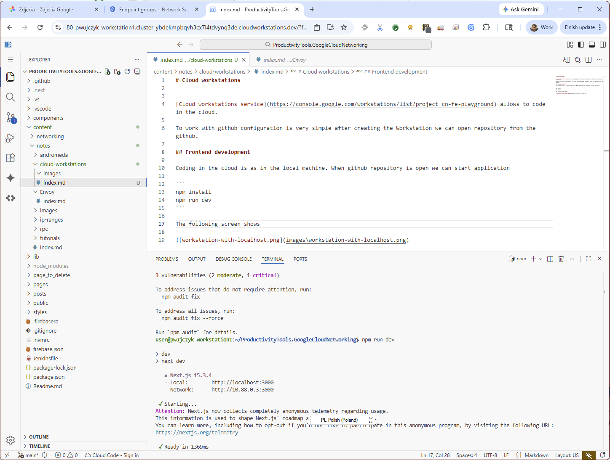
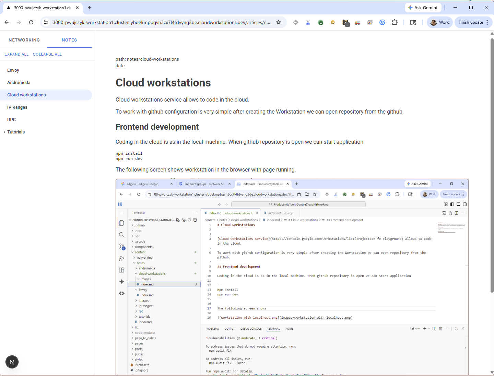

# Cloud workstations


[Cloud workstations service](https://console.google.com/workstations/list?project=cn-fe-playground) allows to code in the cloud. 

To work with github configuration is very simple after creating the Workstation we can open repository from the github.

## Frontend development

Coding in the cloud is as in the local machine. When github repository is open we can start application

```
npm install
npm run dev
```

The following screen shows workstation in the browser with page running.




We see that it listen on localhost:3000 but in reality if we click it proxy page will open proxy page.



