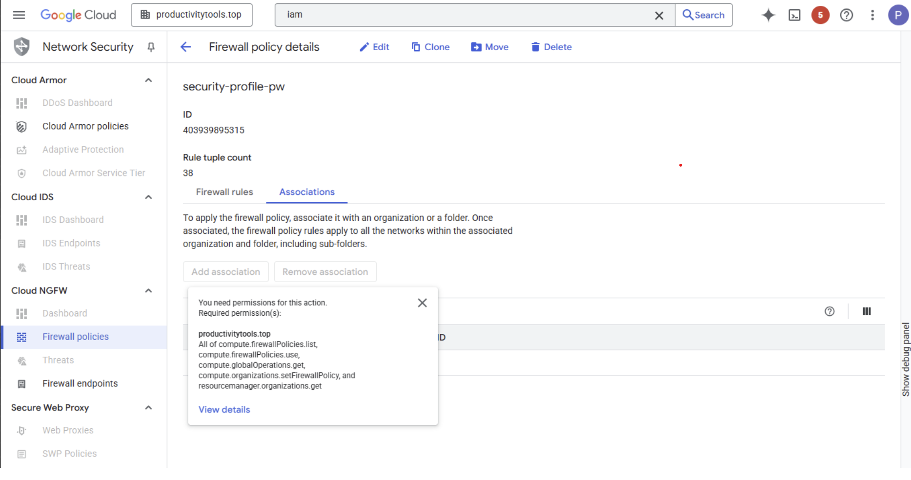
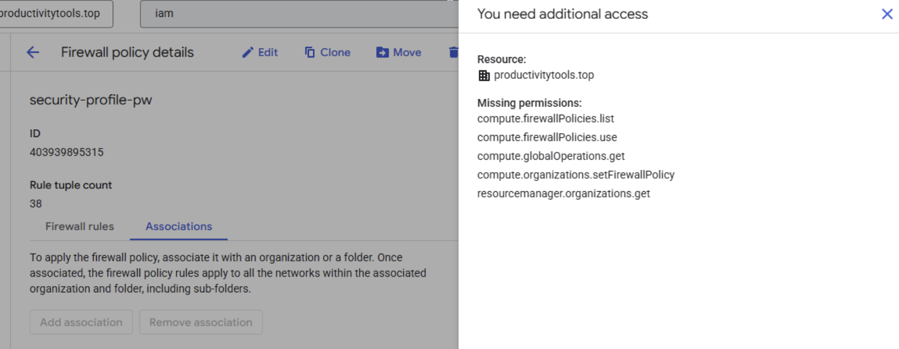
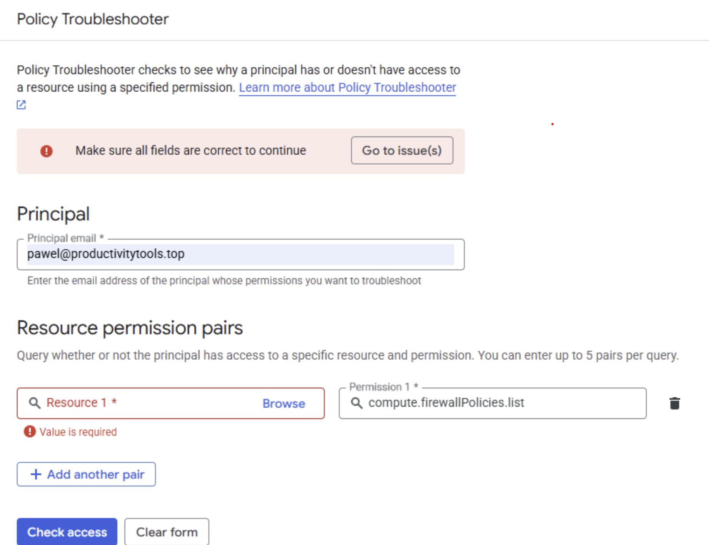
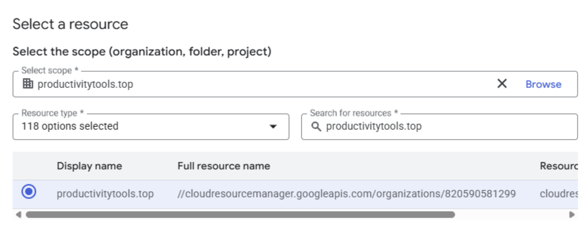

Link

Let us go through example

I see that I have one button disabled and when I hover it I see that I miss permissions

Clicking View details I see that the resource that I need permission is the productivitytools.top organization

Let us go to the policy troubleshooter IAM and Admin > Policy Troubleshooter

I provided the email that I am logged in and the permission that was listed in the tooltip.

For the resource I chose Browse and look for the resource that was listed in the side panel - productivitytools.top

