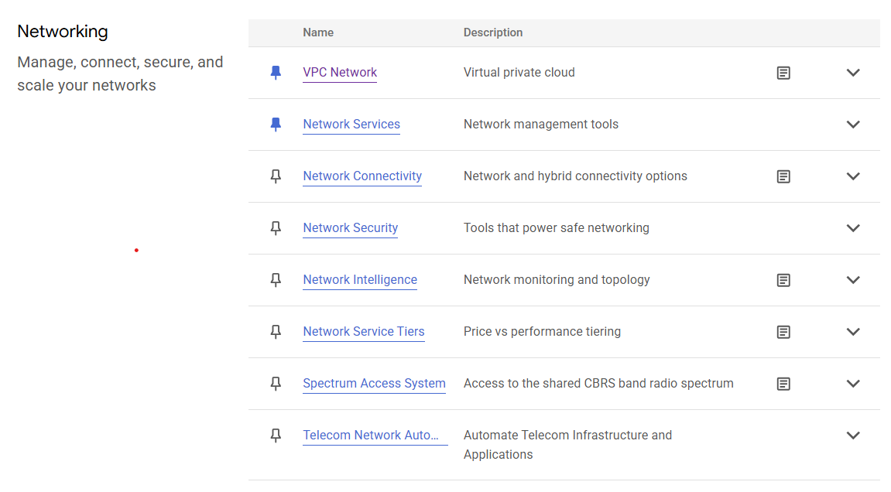

Short description of all Networking tabs

## VPC Network
- VPC Networks 
    - view VPC network and subnets in the network. Create VPC Network button
- IP Addresses
    - list ip addresses assigned to your VMs
    - reserve static internal or external IP button
- Internal ranges
- Bring your own IP
- Firewall
- Routes
- VPC network peering
- Shared VPC
- Serverless VPC access
- Packet mirroring
- VPC Flow logs
## Nework services
## Network Connectivity
## Network Security
## Network Intelligence
## Network Service Tiers
## Spectrum Access System
## Telecom NEtwork Application